# Sơ Đồ Lớp - Dự Án WingIt

## Tổng Quan Kiến Trúc
Dự án WingIt là một ứng dụng mạng xã hội với 3 thành phần chính:
- **Backend**: Spring Boot (Java) - API REST và WebSocket
- **Frontend**: Next.js/React (TypeScript) - Giao diện người dùng
- **AI Service**: Flask (Python) - Phát hiện nội dung độc hại

---

## 1. BACKEND LAYER (Spring Boot)

### 1.1 Entity Layer (Model)

```mermaid
classDiagram
    %% Core User Management
    class User {
        -Integer id
        -String username
        -String password
        -String email
        -String provider
        -String providerId
        -Role role
        -UserData userData
        -List~Post~ posts
        -List~Comment~ comments
        -List~Friend~ friendsAsUser1
        -List~Friend~ friendsAsUser2
        -List~FriendRequest~ sentFriendRequests
        -List~FriendRequest~ receivedFriendRequests
        -List~Block~ blockedUsers
        -List~Block~ blockedByUsers
        -List~Message~ sentMessages
        -List~RoomUser~ roomUsers
        -List~PostReaction~ postReactions
        -List~CommentReaction~ commentReactions
        +getCreatedDate() LocalDate
    }

    class UserData {
        -Integer id
        -User user
        -String displayName
        -String bio
        -String profilePicture
        -String coverPhoto
        -LocalDate dateOfBirth
        -LocalDate createdAt
        +onCreate() void
    }

    class Role {
        -Integer id
        -String roleName
        -List~User~ users
    }

    %% Content Management
    class Post {
        -Long id
        -User user
        -String content
        -LocalDateTime createdDate
        -PostType type
        -Location location
        -List~Comment~ comments
        -List~PostMedia~ media
        -List~PostReaction~ reactions
        -LocalDateTime updatedAt
        +onCreate() void
        +onUpdate() void
    }

    class PostType {
        -Integer id
        -String type
        -List~Post~ posts
    }

    class PostMedia {
        -Long id
        -Post post
        -String mediaUrl
        -String mediaType
        -LocalDateTime uploadedAt
    }

    class Comment {
        -Long id
        -Post post
        -User user
        -String text
        -Boolean isReply
        -List~CommentReaction~ reactions
        -LocalDateTime createdDate
        -LocalDateTime updatedAt
        +onCreate() void
        +onUpdate() void
    }

    class CommentReply {
        -Long id
        -Comment comment
        -User user
        -String text
        -LocalDateTime createdDate
    }

    %% Reaction System
    class PostReaction {
        -Long id
        -Post post
        -User user
        -ReactionType reactionType
        -LocalDateTime reactionDate
    }

    class CommentReaction {
        -Long id
        -Comment comment
        -User user
        -ReactionType reactionType
        -LocalDateTime reactionDate
    }

    class ReactionType {
        -Integer id
        -String type
        -List~PostReaction~ postReactions
        -List~CommentReaction~ commentReactions
    }

    %% Social Features
    class Friend {
        -Long id
        -User user1
        -User user2
        -LocalDateTime friendshipDate
        +onCreate() void
    }

    class FriendRequest {
        -Long id
        -User sender
        -User receiver
        -RequestStatus status
        -LocalDateTime requestDate
    }

    class Follow {
        -Long id
        -User follower
        -User following
        -LocalDateTime followDate
    }

    class Block {
        -Long id
        -User user
        -User blockedUser
        -LocalDateTime blockDate
    }

    %% Chat System
    class ChatRoom {
        -Long id
        -String roomName
        -Boolean isGroupChat
        -LocalDateTime createdDate
        -List~Message~ messages
        -List~RoomUser~ roomUsers
        +onCreate() void
    }

    class Message {
        -Long id
        -ChatRoom chatRoom
        -User sender
        -String content
        -LocalDateTime timestamp
        +onCreate() void
    }

    class RoomUser {
        -Long id
        -ChatRoom chatRoom
        -User user
        -LocalDateTime joinedDate
        -Boolean isActive
    }

    %% Support Entities
    class Location {
        -Integer id
        -String location
    }

    class RequestStatus {
        -Integer id
        -String status
    }

    class Notification {
        -Long id
        -User user
        -String message
        -String type
        -Boolean isRead
        -LocalDateTime createdDate
    }

    class Report {
        -Long id
        -User reporter
        -User reportedUser
        -Post reportedPost
        -Comment reportedComment
        -String reason
        -String status
        -LocalDateTime reportDate
    }

    class Bookmark {
        -Long id
        -User user
        -Post post
        -LocalDateTime bookmarkDate
    }

    class PostView {
        -Long id
        -Post post
        -User user
        -LocalDateTime viewDate
    }

    %% Security Tokens
    class PasswordResetToken {
        -Long id
        -User user
        -String token
        -LocalDateTime expiryDate
    }

    class EmailChangeToken {
        -Long id
        -User user
        -String token
        -String newEmail
        -LocalDateTime expiryDate
    }

    %% Relationships
    User ||--|| UserData : has
    User }|--|| Role : belongs to
    User ||--o{ Post : creates
    User ||--o{ Comment : writes
    User ||--o{ Friend : has friendship
    User ||--o{ FriendRequest : sends/receives
    User ||--o{ Block : blocks/blocked by
    User ||--o{ Message : sends
    User ||--o{ PostReaction : reacts to posts
    User ||--o{ CommentReaction : reacts to comments
    User ||--o{ RoomUser : participates in rooms

    Post }|--|| PostType : has type
    Post }|--|| Location : located at
    Post ||--o{ Comment : has comments
    Post ||--o{ PostMedia : has media
    Post ||--o{ PostReaction : receives reactions
    Post ||--o{ Bookmark : bookmarked by
    Post ||--o{ PostView : viewed by

    Comment ||--o{ CommentReaction : receives reactions
    Comment ||--o{ CommentReply : has replies

    PostReaction }|--|| ReactionType : uses type
    CommentReaction }|--|| ReactionType : uses type

    FriendRequest }|--|| RequestStatus : has status

    ChatRoom ||--o{ Message : contains
    ChatRoom ||--o{ RoomUser : has members

    Friend ||--|| User : user1
    Friend ||--|| User : user2
```

### 1.2 Service Layer

```mermaid
classDiagram
    %% Core Services
    class UserService {
        -UserRepository userRepository
        -PasswordEncoder passwordEncoder
        +createUser(UserDto) User
        +findByUsername(String) User
        +updateUser(Integer, UserDto) User
        +deleteUser(Integer) void
        +authenticateUser(String, String) boolean
    }

    class PostService {
        -PostRepository postRepository
        -UserService userService
        +createPost(PostDto) Post
        +getAllPosts() List~Post~
        +getPostsByUser(Integer) List~Post~
        +updatePost(Long, PostDto) Post
        +deletePost(Long) void
        +getPostsByLocation(Integer) List~Post~
    }

    class CommentService {
        -CommentRepository commentRepository
        -PostService postService
        +createComment(CommentDto) Comment
        +getCommentsByPost(Long) List~Comment~
        +updateComment(Long, CommentDto) Comment
        +deleteComment(Long) void
    }

    class FriendService {
        -FriendRepository friendRepository
        -UserService userService
        +sendFriendRequest(Integer, Integer) FriendRequest
        +acceptFriendRequest(Long) Friend
        +rejectFriendRequest(Long) void
        +getFriends(Integer) List~User~
        +removeFriend(Integer, Integer) void
    }

    class ChatRoomService {
        -ChatRoomRepository chatRoomRepository
        -MessageService messageService
        +createChatRoom(ChatRoomDto) ChatRoom
        +getChatRoomsByUser(Integer) List~ChatRoom~
        +addUserToRoom(Long, Integer) RoomUser
        +removeUserFromRoom(Long, Integer) void
    }

    class MessageService {
        -MessageRepository messageRepository
        -ChatRoomService chatRoomService
        +sendMessage(MessageDto) Message
        +getMessagesByRoom(Long) List~Message~
        +deleteMessage(Long) void
    }

    class NotificationService {
        -NotificationRepository notificationRepository
        +createNotification(NotificationDto) Notification
        +getNotificationsByUser(Integer) List~Notification~
        +markAsRead(Long) void
        +deleteNotification(Long) void
    }

    %% Security Services
    class CustomUserDetailsService {
        -UserService userService
        +loadUserByUsername(String) UserDetails
    }

    class OAuth2AuthenticationSuccessHandler {
        -UserService userService
        +onAuthenticationSuccess(HttpServletRequest, HttpServletResponse, Authentication) void
    }

    class OAuth2AuthenticationFailureHandler {
        +onAuthenticationFailure(HttpServletRequest, HttpServletResponse, AuthenticationException) void
    }

    %% Utility Services
    class EmailService {
        -JavaMailSender mailSender
        +sendEmail(String, String, String) void
        +sendPasswordResetEmail(String, String) void
        +sendEmailVerification(String, String) void
    }

    class CloudinaryService {
        -Cloudinary cloudinary
        +uploadImage(MultipartFile) String
        +deleteImage(String) void
        +uploadVideo(MultipartFile) String
    }

    class ProfanityDetectionService {
        -String aiServiceUrl
        +checkProfanity(String) boolean
        +analyzeSentiment(String) String
    }
```



### 1.3 Controller Layer

```mermaid
classDiagram
    %% REST Controllers
    class AuthController {
        -UserService userService
        -AuthenticationManager authManager
        +login(LoginDto) ResponseEntity
        +register(RegisterDto) ResponseEntity
        +logout() ResponseEntity
        +refreshToken(String) ResponseEntity
    }

    class UserController {
        -UserService userService
        +getProfile(Integer) ResponseEntity
        +updateProfile(Integer, UserDto) ResponseEntity
        +searchUsers(String) ResponseEntity
        +getUserPosts(Integer) ResponseEntity
    }

    class PostController {
        -PostService postService
        -ProfanityDetectionService profanityService
        +createPost(PostDto) ResponseEntity
        +getAllPosts() ResponseEntity
        +getPost(Long) ResponseEntity
        +updatePost(Long, PostDto) ResponseEntity
        +deletePost(Long) ResponseEntity
        +getPostsByLocation(Integer) ResponseEntity
    }

    class CommentController {
        -CommentService commentService
        +createComment(CommentDto) ResponseEntity
        +getComments(Long) ResponseEntity
        +updateComment(Long, CommentDto) ResponseEntity
        +deleteComment(Long) ResponseEntity
    }

    class FriendController {
        -FriendService friendService
        +sendFriendRequest(FriendRequestDto) ResponseEntity
        +getFriendRequests(Integer) ResponseEntity
        +acceptFriendRequest(Long) ResponseEntity
        +rejectFriendRequest(Long) ResponseEntity
        +getFriends(Integer) ResponseEntity
    }

    class ChatRoomController {
        -ChatRoomService chatRoomService
        +createChatRoom(ChatRoomDto) ResponseEntity
        +getChatRooms(Integer) ResponseEntity
        +joinChatRoom(Long, Integer) ResponseEntity
        +leaveChatRoom(Long, Integer) ResponseEntity
    }

    class MessageController {
        -MessageService messageService
        +sendMessage(MessageDto) ResponseEntity
        +getMessages(Long) ResponseEntity
        +deleteMessage(Long) ResponseEntity
    }

    %% WebSocket Controller
    class WebSocketController {
        -SimpMessagingTemplate template
        -MessageService messageService
        +sendMessage(MessageDto) void
        +sendNotification(NotificationDto) void
        +handleTyping(TypingDto) void
    }

    class AdminController {
        -UserService userService
        -PostService postService
        -ReportService reportService
        +getAllUsers() ResponseEntity
        +banUser(Integer) ResponseEntity
        +deletePost(Long) ResponseEntity
        +getReports() ResponseEntity
        +resolveReport(Long, String) ResponseEntity
    }
```



---

## 2. FRONTEND LAYER (Next.js/React)

### 2.1 Component Architecture


### 2.2 Context & State Management


### 2.3 Types & Interfaces

```mermaid
classDiagram
    %% User Types
    class User {
        +id string
        +username string
        +email string
        +displayName string
        +bio string
        +profilePicture string
        +coverPhoto string
        +dateOfBirth Date
        +createdAt Date
        +role Role
        +isOnline boolean
    }

    class UserData {
        +displayName string
        +bio string
        +profilePicture string
        +coverPhoto string
        +dateOfBirth Date
        +location Location
    }

    %% Post Types
    class Post {
        +id string
        +content string
        +author User
        +createdAt Date
        +updatedAt Date
        +type PostType
        +location Location
        +media List~PostMedia~
        +reactions List~PostReaction~
        +comments List~Comment~
        +totalLikes number
        +totalComments number
        +isLiked boolean
        +isBookmarked boolean
    }

    class PostMedia {
        +id string
        +url string
        +type MediaType
        +uploadedAt Date
    }

    class PostReaction {
        +id string
        +user User
        +type ReactionType
        +createdAt Date
    }

    %% Comment Types
    class Comment {
        +id string
        +content string
        +authorName string
        +authorUsername string
        +authorAvatar string
        +likes number
        +dislikes number
        +liked boolean
        +disliked boolean
        +totalReactions number
        +userReaction UserReaction | null
        +createdAt Date
        +replies List~Comment~
        +parentId string
    }

    class CommentReply {
        +id string
        +content string
        +authorName string
        +authorUsername string
        +authorAvatar string
        +likes number
        +dislikes number
        +liked boolean
        +disliked boolean
        +totalReactions number
        +userReaction UserReaction | null
        +createdAt Date
        +parentId string
    }

    %% Chat Types
    class ChatRoom {
        +id string
        +name string
        +isGroupChat boolean
        +participants List~User~
        +lastMessage Message
        +createdAt Date
        +unreadCount number
    }

    class Message {
        +id string
        +content string
        +sender User
        +chatRoom ChatRoom
        +timestamp Date
        +isRead boolean
        +messageType MessageType
    }

    %% Utility Types
    class Location {
        +id string
        +name string
        +coordinates Coordinates
    }

    class Notification {
        +id string
        +type NotificationType
        +message string
        +isRead boolean
        +createdAt Date
        +actionUrl string
        +relatedUser User
    }

    %% Enum Types
    class PostType {
        +id string
        +name string
        +icon string
    }

    class ReactionType {
        +id string
        +name string
        +icon string
        +emoji string
    }

    class Role {
        +id string
        +name string
        +permissions List~string~
    }

    class MediaType {
        <<enumeration>>
        IMAGE
        VIDEO
        AUDIO
        DOCUMENT
    }

    class NotificationType {
        <<enumeration>>
        FRIEND_REQUEST
        POST_LIKE
        COMMENT_LIKE
        NEW_MESSAGE
        POST_COMMENT
        MENTION
    }

    class MessageType {
        <<enumeration>>
        TEXT
        IMAGE
        VIDEO
        FILE
        SYSTEM
    }
```



---

## 3. AI SERVICE LAYER (Python Flask)


---

## 4. KIẾN TRÚC TỔNG QUAN


---

## 5. SECURITY & AUTHENTICATION


---

## 6. DATABASE SCHEMA


---

## Kết Luận

Sơ đồ lớp này thể hiện:

1. **Kiến trúc phân lớp rõ ràng**: Entity → Service → Controller
2. **Quản lý quan hệ phức tạp**: User, Post, Comment, Chat system
3. **Tính năng mạng xã hội đầy đủ**: Bạn bè, nhắn tin, phản ứng, bookmark
4. **Bảo mật cao**: JWT, OAuth2, phân quyền
5. **AI tích hợp**: Phát hiện nội dung độc hại bằng PhoBERT
6. **Giao diện hiện đại**: React/Next.js với TypeScript
7. **Real-time**: WebSocket cho chat và thông báo
8. **Scalable**: Microservice architecture với AI service riêng biệt

Dự án WingIt là một ứng dụng mạng xã hội hoàn chỉnh với các tính năng hiện đại và kiến trúc kỹ thuật vững chắc.
