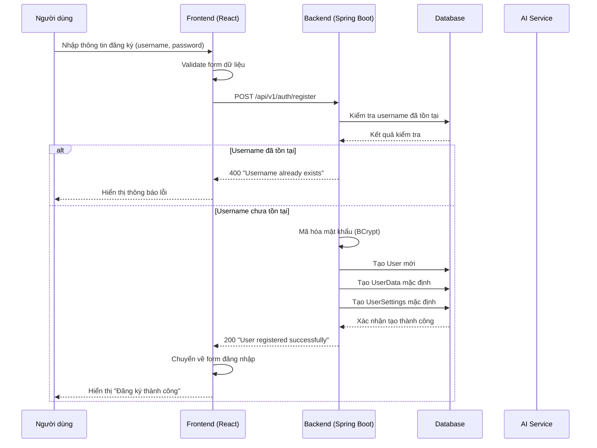
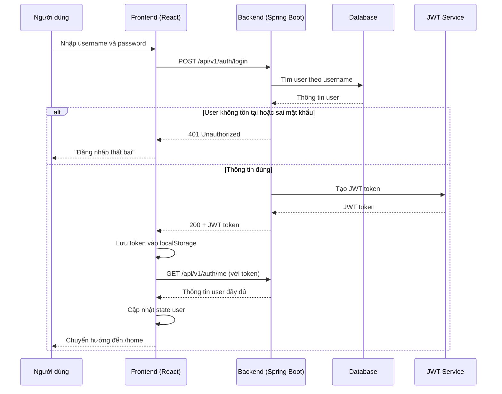
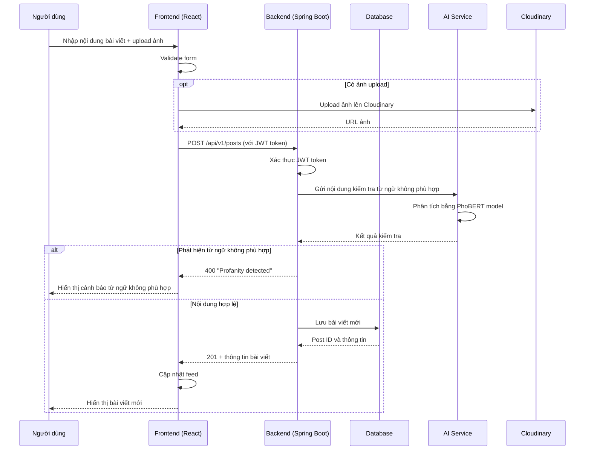
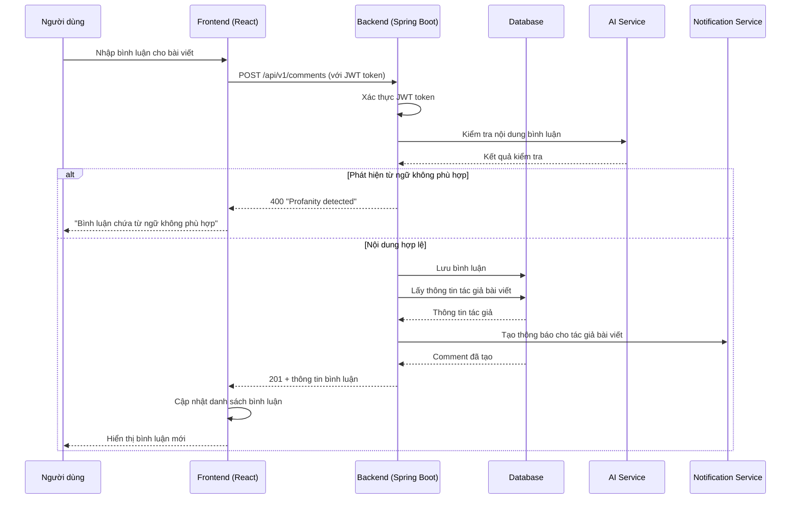
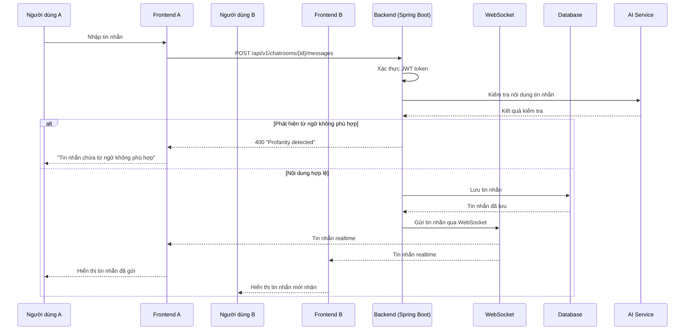
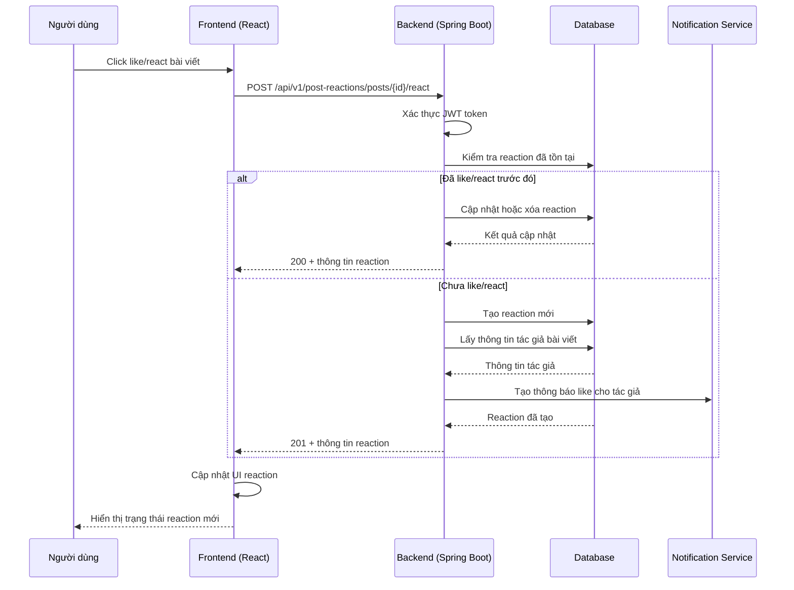
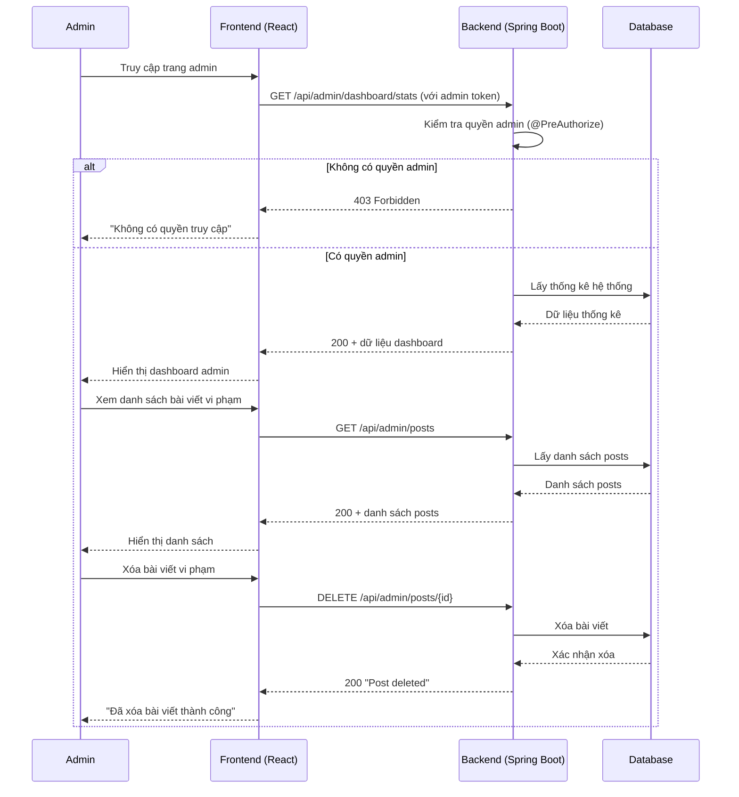
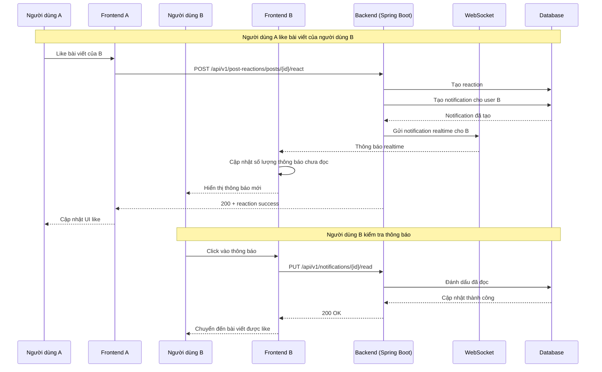

# Sơ Đồ Tuần Tự Hệ Thống WingIt

## 1. Sơ Đồ Tuần Tự - Đăng Ký Tài Khoản



## 2. Sơ Đồ Tuần Tự - Đăng Nhập



## 3. Sơ Đồ Tuần Tự - Tạo Bài Viết



## 4. Sơ Đồ Tuần Tự - Tạo Bình Luận



## 5. Sơ Đồ Tuần Tự - Nhắn Tin Realtime



## 6. Sơ Đồ Tuần Tự - Tương Tác Bài Viết (Like/React)



## 7. Sơ Đồ Tuần Tự - Quản Trị Hệ Thống



## 8. Sơ Đồ Tuần Tự - Cập Nhật Thông Báo Realtime



## 3.2 TRIỂN KHAI HỆ THỐNG AI PHÁT HIỆN NỘI DUNG KHÔNG PHÙ HỢP

### 3.2.1 Xây dựng mô hình PhoBERT cho tiếng Việt
Hệ thống sử dụng mô hình PhoBERT (Vietnamese BERT) được huấn luyện đặc biệt để phát hiện từ ngữ không phù hợp trong tiếng Việt. Mô hình được xây dựng với kiến trúc:

```python
class PhoBERTForTokenClassification(nn.Module):
    def __init__(self, model_name, num_labels, dropout_rate=0.3):
        super().__init__()
        self.num_labels = num_labels
        self.phobert = AutoModel.from_pretrained(model_name)
        
        # Anti-overfitting layers
        self.dropout = nn.Dropout(dropout_rate)
        self.layer_norm = nn.LayerNorm(self.phobert.config.hidden_size)
        
        # Classification head
        self.classifier = nn.Linear(self.phobert.config.hidden_size, num_labels)
```

**Cấu hình mô hình:**
- Model name: `vinai/phobert-base`
- Max length: 128 tokens
- Labels: `['O', 'B-T', 'I-T']` (O: Clean, B-T: Begin Toxic, I-T: Inside Toxic)
- Confidence threshold: 0.7
- Dropout rate: 0.3

### 3.2.2 Thiết lập AI Server với Flask
Xây dựng AI server độc lập chạy trên Python Flask để xử lý các yêu cầu phát hiện nội dung:

```python
@app.route('/detect', methods=['POST'])
def detect_profanity():
    try:
        detector = get_detector()
        data = request.get_json()
        text = data['text']
        
        # Phát hiện từ ngữ không phù hợp
        result = detector.detect_profanity(text)
        result['timestamp'] = time.time()
        result['model_version'] = 'phobert-trained-1.0'
        
        return jsonify(result)
    except Exception as e:
        return jsonify({
            'error': f'Server error: {str(e)}',
            'is_profane': False,
            'confidence': 0.0
        }), 500
```

**Endpoints AI Server:**
- `GET /health` - Kiểm tra trạng thái server và model
- `POST /detect` - Phát hiện nội dung không phù hợp
- `GET /model_info` - Thông tin chi tiết về model

### 3.2.3 Tích hợp AI vào Backend Spring Boot
Tạo service để kết nối từ Spring Boot backend đến AI server:

```java
@Service
public class ProfanityDetectionService {
    @Value("${profanity.detection.url:http://localhost:5000}")
    private String profanityServerUrl;
    
    public ProfanityResult checkProfanity(String text) {
        // Kiểm tra AI server có sẵn sàng
        if (!isServerHealthy()) {
            throw new RuntimeException("Hệ thống kiểm tra nội dung đang khởi động. Vui lòng thử lại sau 2-3 phút.");
        }
        
        // Gửi request đến AI server
        Map<String, Object> requestBody = new HashMap<>();
        requestBody.put("text", text);
        
        ResponseEntity<ProfanityApiResponse> response = restTemplate.postForEntity(
            profanityServerUrl + "/detect", requestBody, ProfanityApiResponse.class
        );
        
        // Xử lý kết quả
        if (response.getStatusCode().is2xxSuccessful() && response.getBody() != null) {
            ProfanityApiResponse apiResponse = response.getBody();
            return ProfanityResult.builder()
                .profane(apiResponse.isProfane)
                .confidence(apiResponse.confidence)
                .originalText(text)
                .processedText(apiResponse.processedText)
                .toxicSpans(apiResponse.toxicSpans)
                .build();
        }
    }
}
```

### 3.2.4 Quy trình phát hiện nội dung trong Comment
Khi người dùng tạo bình luận, hệ thống sẽ kiểm tra nội dung qua AI:

```java
public CommentDTO createComment(Long postId, CreateCommentRequest request, Integer userId) {
    String commentText = request.getActualText();
    
    // Kiểm tra nội dung qua AI
    try {
        ProfanityResult profanityResult = profanityDetectionService.checkProfanity(commentText);
        
        if (profanityResult.isProfane()) {
            throw new RuntimeException("Bình luận chứa từ ngữ không phù hợp. Vui lòng chỉnh sửa và thử lại.");
        }
    } catch (RuntimeException e) {
        String errorMsg = e.getMessage();
        if (errorMsg.contains("đang khởi động") || errorMsg.contains("tạm thời không khả dụng")) {
            throw e; // Thông báo AI server đang loading
        }
        throw new RuntimeException("Hệ thống kiểm tra nội dung tạm thời không khả dụng. Vui lòng thử lại sau.");
    }
    
    // Lưu bình luận nếu nội dung hợp lệ
    Comment comment = new Comment();
    comment.setText(commentText);
    // ... save comment
}
```

### 3.2.5 Xử lý phản hồi cho người dùng
Dựa trên kết quả phân tích từ AI, hệ thống sẽ trả về phản hồi phù hợp:

**Frontend xử lý lỗi profanity:**
```typescript
try {
    await CommentService.createComment(commentData);
    // Hiển thị bình luận thành công
} catch (error: any) {
    const errorData = error?.response?.data;
    
    if (errorData?.isProfanityError === true || 
        errorData?.error === 'PROFANITY_DETECTED') {
        // Hiển thị modal cảnh báo từ ngữ không phù hợp
        setProfanityResult({
            is_profane: true,
            confidence: errorData?.confidence || 0.8,
            toxic_spans: errorData?.toxicSpans || [],
            processed_text: newComment
        });
        setShowProfanityWarning(true);
    } else {
        // Hiển thị lỗi khác
        alert("Không thể tạo bình luận. Vui lòng thử lại.");
    }
}
```

**Các trạng thái phản hồi:**
- **Nội dung hợp lệ**: "Bình luận thành công" - bình luận được đăng lên hệ thống
- **Phát hiện từ ngữ không phù hợp**: "Nội dung chứa từ ngữ không phù hợp. Vui lòng chỉnh sửa và thử lại."
- **AI server đang loading**: "Hệ thống kiểm tra nội dung đang khởi động. Vui lòng thử lại sau 2-3 phút."
- **AI server lỗi**: "Hệ thống kiểm tra nội dung tạm thời không khả dụng. Vui lòng thử lại sau."

### 3.2.6 Tối ưu hóa hiệu suất AI
**Persistent Model Loading**: AI server giữ model trong memory để phản hồi nhanh:
```python
class ProfanityDetector:
    def __init__(self):
        self.model_loaded = False
        self.loading_in_progress = False
        # Load model trong background thread
        threading.Thread(target=self._load_model_async, daemon=True).start()
    
    def detect_profanity(self, text):
        if not self.is_ready():
            return {'error': 'Model is still loading, please wait...'}
        
        # Xử lý nhanh với model đã load
        return self._process_text_with_model(text, self.tokenizer, self.model)
```

**Health Check System**: Kiểm tra trạng thái AI server trước khi gửi request:
```java
public boolean isServerHealthy() {
    try {
        ResponseEntity<Map<String, Object>> response = restTemplate.getForEntity(
            profanityServerUrl + "/health", Map.class
        );
        
        if (response.getStatusCode().is2xxSuccessful() && response.getBody() != null) {
            Map<String, Object> health = response.getBody();
            boolean isHealthy = "healthy".equals(health.get("status"));
            boolean modelLoaded = Boolean.TRUE.equals(health.get("model_loaded"));
            return isHealthy && modelLoaded;
        }
    } catch (Exception e) {
        return false;
    }
    return false;
}
```

## Ưu điểm của hệ thống AI:
1. **Đơn giản và hiệu quả**: Chỉ tập trung vào 1 tác vụ chính - phát hiện từ ngữ không phù hợp
2. **Tích hợp liền mạch**: AI server độc lập, dễ scale và maintain
3. **Phản hồi thân thiện**: Thông báo rõ ràng cho người dùng về trạng thái hệ thống
4. **Xử lý lỗi tốt**: Graceful degradation khi AI server không khả dụng
5. **Tối ưu memory**: Model persistent, phản hồi nhanh cho requests tiếp theo

---

## 1. Sơ Đồ Tuần Tự - Đăng Ký Tài Khoản


## 2. Sơ Đồ Tuần Tự - Đăng Nhập


## 3. Sơ Đồ Tuần Tự - Tạo Bài Viết


## 4. Sơ Đồ Tuần Tự - Tạo Bình Luận


## 5. Sơ Đồ Tuần Tự - Nhắn Tin Realtime


## 6. Sơ Đồ Tuần Tự - Tương Tác Bài Viết (Like/React)


## 7. Sơ Đồ Tuần Tự - Quản Trị Hệ Thống


## 8. Sơ Đồ Tuần Tự - Cập Nhật Thông Báo Realtime


## 3.2 TRIỂN KHAI HỆ THỐNG AI PHÁT HIỆN NỘI DUNG KHÔNG PHÙ HỢP

### 3.2.1 Xây dựng mô hình PhoBERT cho tiếng Việt
Hệ thống sử dụng mô hình PhoBERT (Vietnamese BERT) được huấn luyện đặc biệt để phát hiện từ ngữ không phù hợp trong tiếng Việt. Mô hình được xây dựng với kiến trúc:

```python
class PhoBERTForTokenClassification(nn.Module):
    def __init__(self, model_name, num_labels, dropout_rate=0.3):
        super().__init__()
        self.num_labels = num_labels
        self.phobert = AutoModel.from_pretrained(model_name)
        
        # Anti-overfitting layers
        self.dropout = nn.Dropout(dropout_rate)
        self.layer_norm = nn.LayerNorm(self.phobert.config.hidden_size)
        
        # Classification head
        self.classifier = nn.Linear(self.phobert.config.hidden_size, num_labels)
```

**Cấu hình mô hình:**
- Model name: `vinai/phobert-base`
- Max length: 128 tokens
- Labels: `['O', 'B-T', 'I-T']` (O: Clean, B-T: Begin Toxic, I-T: Inside Toxic)
- Confidence threshold: 0.7
- Dropout rate: 0.3

### 3.2.2 Thiết lập AI Server với Flask
Xây dựng AI server độc lập chạy trên Python Flask để xử lý các yêu cầu phát hiện nội dung:

```python
@app.route('/detect', methods=['POST'])
def detect_profanity():
    try:
        detector = get_detector()
        data = request.get_json()
        text = data['text']
        
        # Phát hiện từ ngữ không phù hợp
        result = detector.detect_profanity(text)
        result['timestamp'] = time.time()
        result['model_version'] = 'phobert-trained-1.0'
        
        return jsonify(result)
    except Exception as e:
        return jsonify({
            'error': f'Server error: {str(e)}',
            'is_profane': False,
            'confidence': 0.0
        }), 500
```

**Endpoints AI Server:**
- `GET /health` - Kiểm tra trạng thái server và model
- `POST /detect` - Phát hiện nội dung không phù hợp
- `GET /model_info` - Thông tin chi tiết về model

### 3.2.3 Tích hợp AI vào Backend Spring Boot
Tạo service để kết nối từ Spring Boot backend đến AI server:

```java
@Service
public class ProfanityDetectionService {
    @Value("${profanity.detection.url:http://localhost:5000}")
    private String profanityServerUrl;
    
    public ProfanityResult checkProfanity(String text) {
        // Kiểm tra AI server có sẵn sàng
        if (!isServerHealthy()) {
            throw new RuntimeException("Hệ thống kiểm tra nội dung đang khởi động. Vui lòng thử lại sau 2-3 phút.");
        }
        
        // Gửi request đến AI server
        Map<String, Object> requestBody = new HashMap<>();
        requestBody.put("text", text);
        
        ResponseEntity<ProfanityApiResponse> response = restTemplate.postForEntity(
            profanityServerUrl + "/detect", requestBody, ProfanityApiResponse.class
        );
        
        // Xử lý kết quả
        if (response.getStatusCode().is2xxSuccessful() && response.getBody() != null) {
            ProfanityApiResponse apiResponse = response.getBody();
            return ProfanityResult.builder()
                .profane(apiResponse.isProfane)
                .confidence(apiResponse.confidence)
                .originalText(text)
                .processedText(apiResponse.processedText)
                .toxicSpans(apiResponse.toxicSpans)
                .build();
        }
    }
}
```

### 3.2.4 Quy trình phát hiện nội dung trong Comment
Khi người dùng tạo bình luận, hệ thống sẽ kiểm tra nội dung qua AI:

```java
public CommentDTO createComment(Long postId, CreateCommentRequest request, Integer userId) {
    String commentText = request.getActualText();
    
    // Kiểm tra nội dung qua AI
    try {
        ProfanityResult profanityResult = profanityDetectionService.checkProfanity(commentText);
        
        if (profanityResult.isProfane()) {
            throw new RuntimeException("Bình luận chứa từ ngữ không phù hợp. Vui lòng chỉnh sửa và thử lại.");
        }
    } catch (RuntimeException e) {
        String errorMsg = e.getMessage();
        if (errorMsg.contains("đang khởi động") || errorMsg.contains("tạm thời không khả dụng")) {
            throw e; // Thông báo AI server đang loading
        }
        throw new RuntimeException("Hệ thống kiểm tra nội dung tạm thời không khả dụng. Vui lòng thử lại sau.");
    }
    
    // Lưu bình luận nếu nội dung hợp lệ
    Comment comment = new Comment();
    comment.setText(commentText);
    // ... save comment
}
```

### 3.2.5 Xử lý phản hồi cho người dùng
Dựa trên kết quả phân tích từ AI, hệ thống sẽ trả về phản hồi phù hợp:

**Frontend xử lý lỗi profanity:**
```typescript
try {
    await CommentService.createComment(commentData);
    // Hiển thị bình luận thành công
} catch (error: any) {
    const errorData = error?.response?.data;
    
    if (errorData?.isProfanityError === true || 
        errorData?.error === 'PROFANITY_DETECTED') {
        // Hiển thị modal cảnh báo từ ngữ không phù hợp
        setProfanityResult({
            is_profane: true,
            confidence: errorData?.confidence || 0.8,
            toxic_spans: errorData?.toxicSpans || [],
            processed_text: newComment
        });
        setShowProfanityWarning(true);
    } else {
        // Hiển thị lỗi khác
        alert("Không thể tạo bình luận. Vui lòng thử lại.");
    }
}
```

**Các trạng thái phản hồi:**
- **Nội dung hợp lệ**: "Bình luận thành công" - bình luận được đăng lên hệ thống
- **Phát hiện từ ngữ không phù hợp**: "Nội dung chứa từ ngữ không phù hợp. Vui lòng chỉnh sửa và thử lại."
- **AI server đang loading**: "Hệ thống kiểm tra nội dung đang khởi động. Vui lòng thử lại sau 2-3 phút."
- **AI server lỗi**: "Hệ thống kiểm tra nội dung tạm thời không khả dụng. Vui lòng thử lại sau."

### 3.2.6 Tối ưu hóa hiệu suất AI
**Persistent Model Loading**: AI server giữ model trong memory để phản hồi nhanh:
```python
class ProfanityDetector:
    def __init__(self):
        self.model_loaded = False
        self.loading_in_progress = False
        # Load model trong background thread
        threading.Thread(target=self._load_model_async, daemon=True).start()
    
    def detect_profanity(self, text):
        if not self.is_ready():
            return {'error': 'Model is still loading, please wait...'}
        
        # Xử lý nhanh với model đã load
        return self._process_text_with_model(text, self.tokenizer, self.model)
```

**Health Check System**: Kiểm tra trạng thái AI server trước khi gửi request:
```java
public boolean isServerHealthy() {
    try {
        ResponseEntity<Map<String, Object>> response = restTemplate.getForEntity(
            profanityServerUrl + "/health", Map.class
        );
        
        if (response.getStatusCode().is2xxSuccessful() && response.getBody() != null) {
            Map<String, Object> health = response.getBody();
            boolean isHealthy = "healthy".equals(health.get("status"));
            boolean modelLoaded = Boolean.TRUE.equals(health.get("model_loaded"));
            return isHealthy && modelLoaded;
        }
    } catch (Exception e) {
        return false;
    }
    return false;
}
```

## Ưu điểm của hệ thống AI:
1. **Đơn giản và hiệu quả**: Chỉ tập trung vào 1 tác vụ chính - phát hiện từ ngữ không phù hợp
2. **Tích hợp liền mạch**: AI server độc lập, dễ scale và maintain
3. **Phản hồi thân thiện**: Thông báo rõ ràng cho người dùng về trạng thái hệ thống
4. **Xử lý lỗi tốt**: Graceful degradation khi AI server không khả dụng
5. **Tối ưu memory**: Model persistent, phản hồi nhanh cho requests tiếp theo
