# Sơ Đồ Nguyên Lý Hoạt Động - Hệ Thống WingIt

## 📋 Tổng Quan Hệ Thống

WingIt là một nền tảng mạng xã hội hiện đại với kiến trúc microservices, bao gồm các thành phần chính:
- **Frontend**: Next.js/React với TypeScript
- **Backend**: Spring Boot (Java)
- **AI Service**: Flask (Python) với PhoBERT model
- **Database**: PostgreSQL
- **File Storage**: Cloudinary
- **Deployment**: Render Cloud Platform

---

## 🏗️ Sơ Đồ Kiến Trúc Tổng Thể

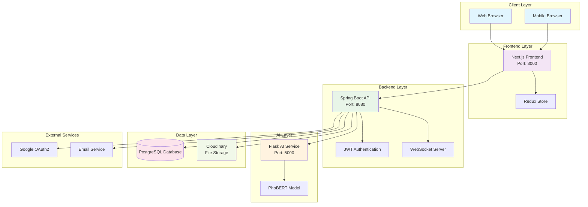

---

## 🔄 Sơ Đồ Luồng Dữ Liệu Chính

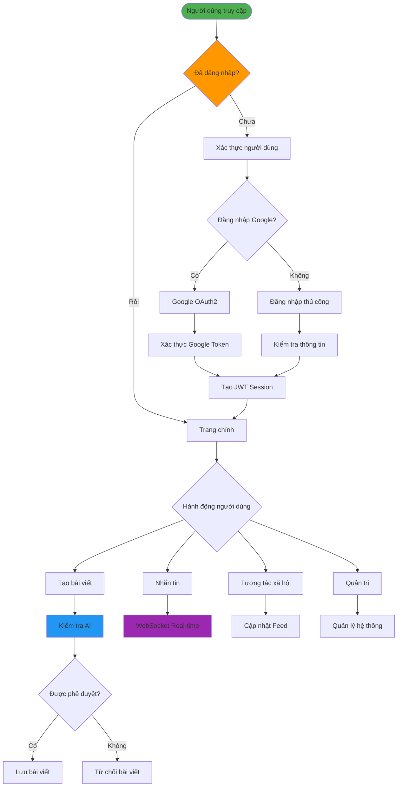

---

## 🔐 Sơ Đồ Quy Trình Xác Thực

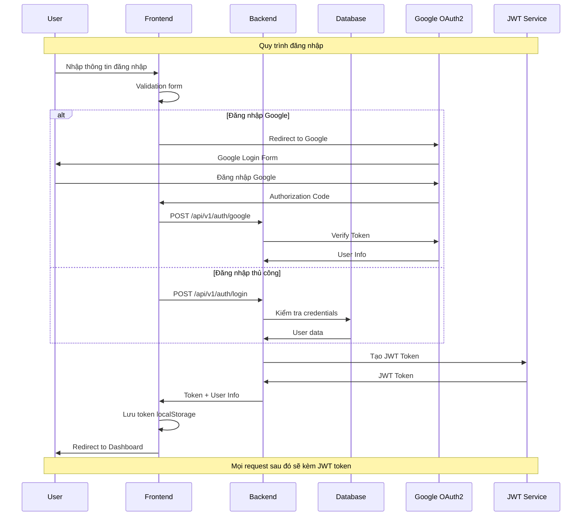

---

## 📝 Sơ Đồ Quy Trình Tạo Bài Viết với AI

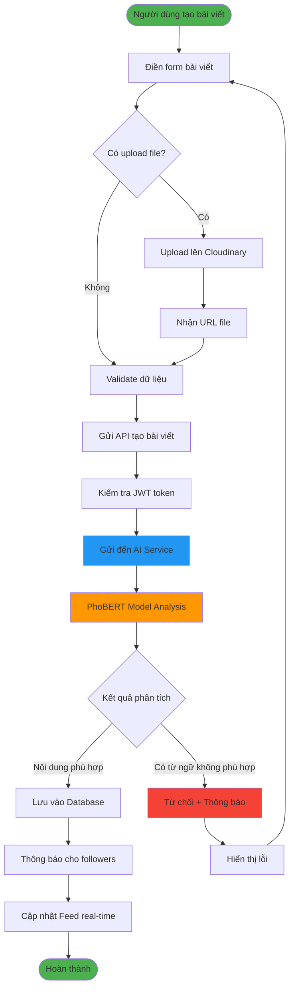

---

## 💬 Sơ Đồ Hệ Thống Chat Real-time

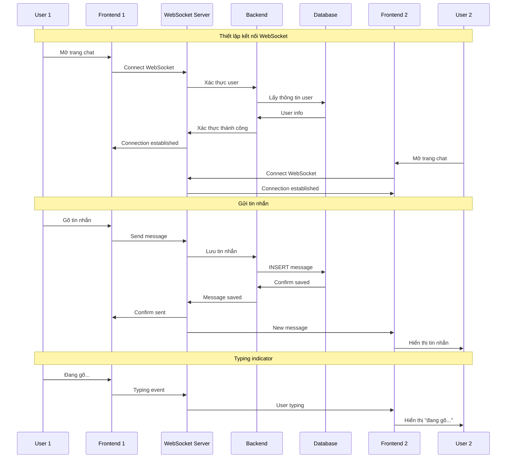

---

## 🛡️ Sơ Đồ Hệ Thống Bảo Mật và Phân Quyền

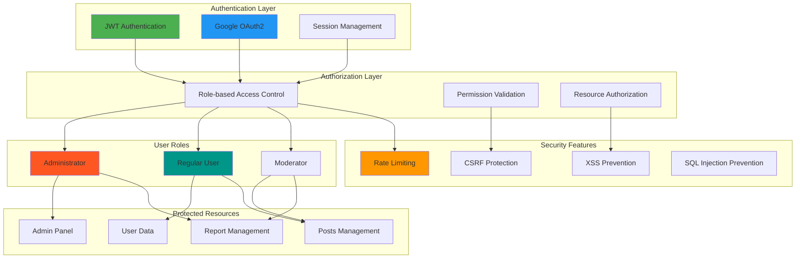

---

## 🤖 Sơ Đồ AI Service và Machine Learning Pipeline

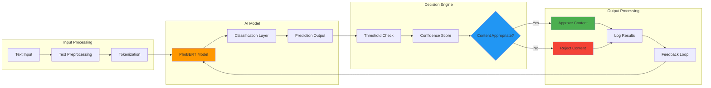

---

## 📊 Sơ Đồ Database Schema

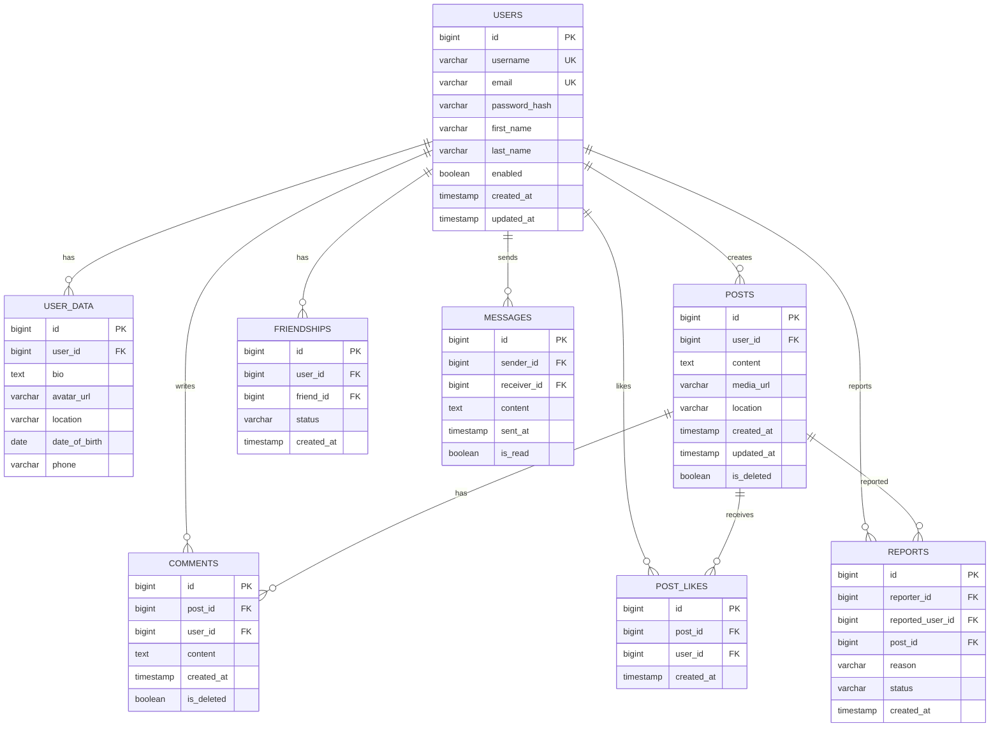

---

## 🚀 Sơ Đồ Deployment và DevOps

```mermaid
graph TB
    subgraph "Development"
        DEV_ENV[Local Development]
        GIT[Git Repository]
        IDE[VS Code IDE]
    end
    
    subgraph "CI/CD Pipeline"
        GITHUB[GitHub Actions]
        BUILD[Build Process]
        TEST[Automated Testing]
        DEPLOY[Deployment]
    end
    
    subgraph "Production Environment - Render"
        FE_RENDER[Frontend Service]
        BE_RENDER[Backend Service]
        AI_RENDER[AI Service]
        DB_RENDER[PostgreSQL Database]
    end
    
    subgraph "External Services"
        CLOUDINARY_PROD[Cloudinary]
        GOOGLE_OAUTH[Google OAuth2]
        EMAIL_SERVICE[Email Service]
    end
    
    subgraph "Monitoring"
        LOGS[Application Logs]
        METRICS[Performance Metrics]
        ALERTS[Error Alerts]
    end
    
    DEV_ENV --> GIT
    GIT --> GITHUB
    GITHUB --> BUILD
    BUILD --> TEST
    TEST --> DEPLOY
    
    DEPLOY --> FE_RENDER
    DEPLOY --> BE_RENDER
    DEPLOY --> AI_RENDER
    
    BE_RENDER --> DB_RENDER
    BE_RENDER --> CLOUDINARY_PROD
    BE_RENDER --> GOOGLE_OAUTH
    BE_RENDER --> EMAIL_SERVICE
    
    FE_RENDER --> LOGS
    BE_RENDER --> LOGS
    AI_RENDER --> LOGS
    
    LOGS --> METRICS
    METRICS --> ALERTS
    
    style GITHUB fill:#333
    style FE_RENDER fill:#61dafb
    style BE_RENDER fill:#6db33f
    style AI_RENDER fill:#ff6f00
    style DB_RENDER fill:#336791
```

---

## 📱 Sơ Đồ User Experience Flow

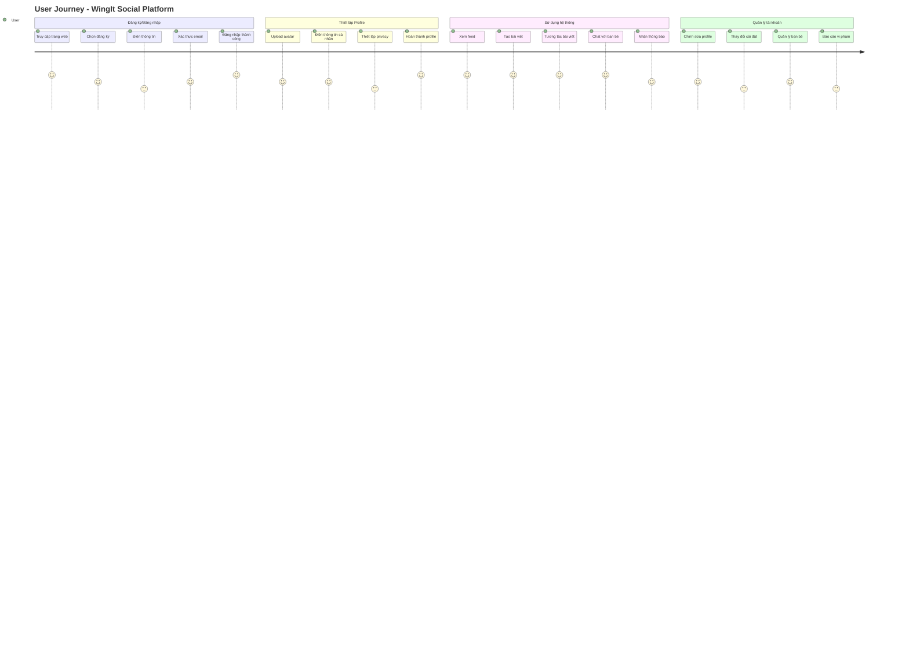

---

## 🔧 Cấu Hình Kỹ Thuật Chi Tiết

### Frontend (Next.js)
- **Framework**: Next.js 15.3.2 với React 18
- **Language**: TypeScript
- **Styling**: Tailwind CSS, Styled Components
- **State Management**: Redux Toolkit
- **UI Components**: NextUI, Ant Design
- **Authentication**: JWT với localStorage
- **Real-time**: WebSocket client
- **Build Tool**: Next.js built-in

### Backend (Spring Boot)
- **Framework**: Spring Boot 3.4.5
- **Language**: Java 17
- **Database**: PostgreSQL (Production), MySQL (Development)
- **Authentication**: JWT + Spring Security
- **Real-time**: WebSocket with STOMP
- **File Upload**: Cloudinary integration
- **API Documentation**: Swagger/OpenAPI
- **Build Tool**: Maven

### AI Service (Flask)
- **Framework**: Flask 2.3.2
- **Language**: Python 3.9+
- **ML Model**: PhoBERT (Vietnamese BERT)
- **Libraries**: Transformers, PyTorch
- **API**: RESTful endpoints
- **Deployment**: Docker container

### Database
- **Production**: PostgreSQL on Render
- **Development**: MySQL local
- **ORM**: JPA/Hibernate
- **Connection Pooling**: HikariCP
- **Migrations**: Flyway

---

## 📈 Sơ Đồ Hiệu Suất và Tối Ưu Hóa

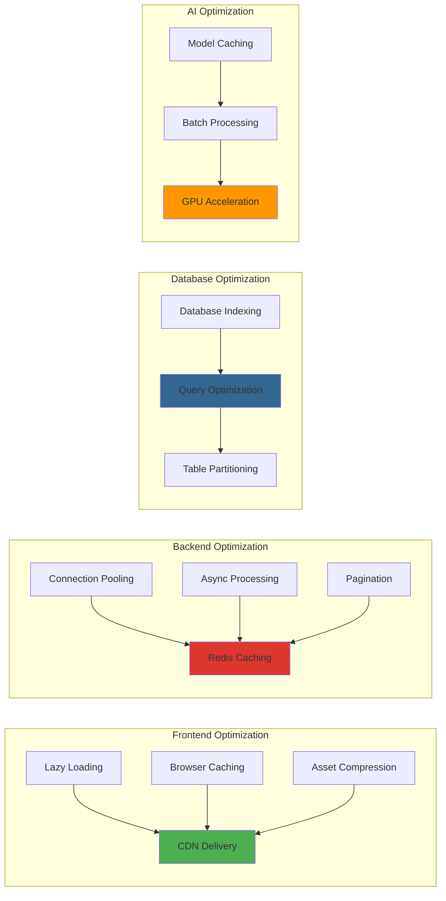

---

## 🎯 Tổng Kết

Hệ thống WingIt được thiết kế với kiến trúc microservices hiện đại, đảm bảo:

### ✅ Ưu điểm
- **Scalability**: Có thể mở rộng từng service độc lập
- **Reliability**: Fault tolerance và error handling
- **Security**: Nhiều lớp bảo mật và xác thực
- **Performance**: Tối ưu hóa từ frontend đến database
- **Maintainability**: Code sạch và kiến trúc rõ ràng
- **AI Integration**: Kiểm duyệt nội dung tự động

### 🚀 Công nghệ sử dụng
- **Frontend**: Next.js, React, TypeScript, Tailwind CSS
- **Backend**: Spring Boot, Java, PostgreSQL
- **AI**: Python, Flask, PhoBERT, Transformers
- **DevOps**: Docker, Render, GitHub Actions
- **External**: Cloudinary, Google OAuth2

### 📊 Khả năng mở rộng
- Hỗ trợ real-time communication
- AI-powered content moderation
- Microservices architecture
- Cloud-native deployment
- Mobile-responsive design
