# WingIt Social Media Platform - Use Cases Documentation

## 📋 Các Chức Năng Theo Diagram Thực Tế

**Người dùng:**
•	Đăng nhập (bao gồm đăng nhập Google OAuth2)
•	Đăng ký tài khoản
•	Chỉnh sửa thông tin cá nhân
•	Đăng bài viết
•	Xem thống kê bài viết
•	Kết bạn với người dùng khác
•	Lưu bài viết (bookmark)
•	Báo cáo bình luận và bài đăng vi phạm
•	Thả cảm xúc (like/dislike) bài viết và bình luận
•	Nhận thông báo real-time
•	Theo dõi người dùng (follow/unfollow)
•	Xem feed và chi tiết bài viết
•	Chặn người dùng không mong muốn
•	Nhắn tin thời gian thực

**Quản trị viên:**
•	Tất cả chức năng của người dùng
•	Xem, sửa, xóa nhóm chat
•	Xem, sửa, xóa người dùng
•	Xem thống kê hệ thống
•	Xem, sửa, xóa bài đăng
•	Xử lý các báo cáo vi phạm

## 📋 Bảng Use Cases (Theo Hệ Thống Thực Tế)

| STT | Tên Use Case | Actor | Mô tả |
|-----|--------------|-------|-------|
| **AUTHENTICATION & USER MANAGEMENT** | | | |
| 1 | Đăng nhập | User, Administrator | Cho phép người dùng đăng nhập vào hệ thống bằng email/username và mật khẩu |
| 2 | Đăng nhập Google OAuth2 | User, Administrator | Cho phép đăng nhập thông qua tài khoản Google (extend của Đăng nhập) |
| 3 | Đăng ký | User | Cho phép tạo tài khoản mới trong hệ thống |
| 4 | Quên mật khẩu | User | Cho phép người dùng reset mật khẩu qua email |
| 5 | Chỉnh sửa thông tin cá nhân | User, Administrator | Cho phép chỉnh sửa profile và thông tin cá nhân |
| 6 | Đăng xuất | User, Administrator | Cho phép người dùng đăng xuất khỏi hệ thống |
| **POST & CONTENT MANAGEMENT** | | | |
| 7 | Đăng bài viết | User, Administrator | Cho phép tạo bài viết mới (có AI moderation) |
| 8 | Chỉnh sửa bài viết | User, Administrator | Cho phép chỉnh sửa bài viết của chính mình |
| 9 | Xóa bài viết | User, Administrator | Cho phép xóa bài viết của chính mình |
| 10 | Xem bài viết | User, Administrator | Hiển thị danh sách và chi tiết bài viết |
| 11 | Xem bài viết theo người dùng | User, Administrator | Xem tất cả bài viết của một người dùng cụ thể |
| 12 | Xem bài viết theo vị trí | User, Administrator | Lọc bài viết theo địa điểm/vị trí |
| 13 | Upload media | User, Administrator | Tải lên hình ảnh/video cho bài viết |
| **COMMENT SYSTEM** | | | |
| 14 | Đăng bình luận | User, Administrator | Cho phép bình luận trên bài viết (có AI moderation) |
| 15 | Xem bình luận | User, Administrator | Hiển thị bình luận của bài viết |
| 16 | Chỉnh sửa bình luận | User, Administrator | Cho phép chỉnh sửa bình luận của chính mình |
| 17 | Xóa bình luận | User, Administrator | Cho phép xóa bình luận của chính mình |
| **REACTION SYSTEM** | | | |
| 18 | Thả cảm xúc bài viết | User, Administrator | Cho phép like/dislike bài viết |
| 19 | Thả cảm xúc bình luận | User, Administrator | Cho phép like/dislike bình luận |
| **SOCIAL FEATURES** | | | |
| 20 | Theo dõi người dùng | User, Administrator | Cho phép follow/unfollow người dùng khác |
| 21 | Chặn người dùng | User, Administrator | Cho phép chặn người dùng không mong muốn |
| 22 | Lưu bài viết | User, Administrator | Cho phép bookmark bài viết để xem lại sau |
| **COMMUNICATION** | | | |
| 23 | Nhắn tin thời gian thực | User, Administrator | Cho phép chat real-time với người dùng khác |
| 24 | Quản lý phòng chat | User, Administrator | Tạo và quản lý các phòng chat |
| 25 | Nhận thông báo real-time | User, Administrator | Hiển thị thông báo tức thời qua WebSocket |
| **SAFETY & REPORTS** | | | |
| 26 | Báo cáo nội dung | User, Administrator | Cho phép báo cáo bài viết/bình luận vi phạm |
| 27 | Xử lý báo cáo | Administrator | Cho phép admin xem và xử lý các báo cáo |
| **ADMIN FEATURES** | | | |
| 28 | Quản lý người dùng | Administrator | Cho phép admin xem, sửa, xóa tài khoản người dùng |
| 29 | Quản lý bài đăng | Administrator | Cho phép admin xem, sửa, xóa bài viết |
| 30 | Xem thống kê hệ thống | Administrator | Hiển thị dashboard và thống kê tổng quan |
| 31 | Kiểm duyệt nội dung với AI | Administrator | Hệ thống AI tự động kiểm duyệt nội dung độc hại |

## 📝 Phân Quyền Chức Năng Theo Vai Trò

| Vai Trò | Chức Năng |
|---------|-----------|
| **Người dùng** | - Đăng nhập, đăng ký, xác nhận email, cập nhật thông tin người dùng<br>- Tìm kiếm bài đăng theo nội dung, tác giả, vị trí<br>- Xem chi tiết bài đăng, hình ảnh, video, thông tin vị trí<br>- Tạo, chỉnh sửa, xóa bài đăng (với kiểm duyệt AI)<br>- Bình luận, trả lời bình luận lồng nhau<br>- Thích (like/dislike) bài đăng và bình luận<br>- Lưu bài đăng vào danh sách bookmark<br>- Gửi/chấp nhận yêu cầu kết bạn, theo dõi người dùng<br>- Chặn người dùng để kiểm soát quyền riêng tư<br>- Trò chuyện thời gian thực (riêng hoặc nhóm) qua WebSocket<br>- Nhận thông báo real-time về tương tác và tin nhắn<br>- Báo cáo nội dung vi phạm<br>- Tùy chỉnh cài đặt cá nhân và giao diện<br>- Tải lên và quản lý media (ảnh, video) |
| **Quản trị viên** | - Quản lý người dùng (tạo, xóa, chỉnh sửa, khóa tài khoản)<br>- Quản lý bài đăng (xóa, chỉnh sửa nội dung vi phạm)<br>- Xem và xử lý báo cáo từ người dùng<br>- Xem thống kê hệ thống và hoạt động người dùng<br>- Kiểm duyệt nội dung với hỗ trợ AI<br>- Quản lý chat room và tin nhắn<br>- Có tất cả quyền của người dùng thông thường |

## 📝 Vai Trò Actors

- **User (Người dùng)**: Người dùng thông thường (bao gồm guest cần đăng nhập để sử dụng)
- **Administrator (Quản trị viên)**: Quản trị viên hệ thống

## 🎯 Sơ Đồ Use Case Theo Actor

```
                    HỆ THỐNG WINGIT SOCIAL MEDIA
                              
┌─────────────────────────────────────────────────────────────────────────────┐
│                                                                             │
│                           NGƯỜI DÙNG                                       │
│                                                                             │
│  • Đăng ký tài khoản           • Tìm kiếm bài đăng                         │
│  • Đăng nhập                   • Tìm kiếm người dùng                       │
│  • Quên mật khẩu               • Lọc bài đăng theo địa điểm                │
│  • Chỉnh sửa thông tin         • Lọc bài đăng theo tiêu chí                │
│  • Đăng bài viết               • Kết bạn                                   │
│  • Đăng bình luận              • Nhắn tin thời gian thực                   │
│  • Thả cảm xúc bài viết        • Chặn người dùng                           │
│  • Thả cảm xúc bình luận       • Báo cáo tin nhắn                          │
│  • Xem feed bài viết           • Báo cáo bài đăng                          │
│  • Lưu bài viết                • Theo dõi người dùng                       │
│  • Nhận thông báo              • Quản lý media                             │
│  • Xem thống kê bài viết       • Cài đặt cá nhân                           │
│                                                                             │
└─────────────────────────────────────────────────────────────────────────────┘

┌─────────────────────────────────────────────────────────────────────────────┐
│                                                                             │
│                          QUẢN TRỊ VIÊN                                     │
│                                                                             │
│  • TẤT CẢ CHỨC NĂNG CỦA NGƯỜI DÙNG                                         │
│  +                                                                          │
│  • Quản lý người dùng           • Xử lý báo cáo                            │
│  • Quản lý bài đăng             • Kiểm duyệt nội dung                      │
│  • Xem thống kê hệ thống        • Quản lý chat room                        │
│                                                                             │
└─────────────────────────────────────────────────────────────────────────────┘

                               KẾ THỪA
                    Quản trị viên ←--extends--← Người dùng
```

### 📊 Phân Tích Actor:

**👤 NGƯỜI DÙNG (User)**
- **Vai trò chính**: Sử dụng các tính năng mạng xã hội cơ bản
- **Số lượng use case**: 24 use case
- **Nhóm chức năng chính**:
  - Quản lý tài khoản (4 use case)
  - Tương tác nội dung (8 use case) 
  - Tìm kiếm & lọc (4 use case)
  - Mạng xã hội (4 use case)
  - Cài đặt & tiện ích (4 use case)

**👨‍💼 QUẢN TRỊ VIÊN (Administrator)**
- **Vai trò chính**: Quản lý và kiểm soát hệ thống
- **Số lượng use case**: 28 use case (24 của User + 4 riêng)
- **Chức năng bổ sung**:
  - Quản lý người dùng
  - Xử lý báo cáo
  - Kiểm duyệt nội dung
  - Thống kê hệ thống

### 🔗 Mối Quan Hệ:
- **Kế thừa (Inheritance)**: Quản trị viên kế thừa tất cả chức năng của Người dùng
- **Mở rộng (Extension)**: Quản trị viên có thêm quyền quản lý hệ thống

## 🔄 Mermaid Use Case Diagram

```mermaid
graph TB
    %% Actors
    User[👤 Người dùng<br/>User]
    Admin[👨‍💼 Quản trị viên<br/>Administrator]
    
    %% System boundary
    subgraph System["🏠 Hệ Thống WingIt Social Media"]
        %% Authentication & Account Management
        UC01[UC01: Đăng nhập]
        UC02[UC02: Đăng ký tài khoản]
        UC03[UC03: Quên mật khẩu]
        UC04[UC04: Chỉnh sửa thông tin tài khoản]
        
        %% Content Creation & Interaction
        UC05[UC05: Đăng bài]
        UC06[UC06: Đăng bình luận]
        UC07[UC07: Thả cảm xúc bài viết]
        UC08[UC08: Thả cảm xúc bình luận]
        
        %% Search & Filter
        UC09[UC09: Tìm kiếm bài đăng]
        UC10[UC10: Tìm kiếm người dùng]
        UC11[UC11: Lọc bài đăng theo địa điểm]
        UC12[UC12: Lọc bài đăng theo tiêu chí]
        
        %% Social Features
        UC13[UC13: Kết bạn]
        UC14[UC14: Nhắn tin thời gian thực]
        UC15[UC15: Chặn người dùng]
        UC20[UC20: Theo dõi người dùng]
        
        %% Reports & Safety
        UC16[UC16: Báo cáo tin nhắn]
        UC17[UC17: Báo cáo bài đăng]
        
        %% General Features
        UC18[UC18: Xem feed bài viết]
        UC19[UC19: Lưu bài viết]
        UC21[UC21: Nhận thông báo]
        UC22[UC22: Xem thống kê bài viết]
        UC23[UC23: Quản lý media]
        UC24[UC24: Cài đặt cá nhân]
        
        %% Admin Only Features
        UC25[UC25: Quản lý người dùng]
        UC26[UC26: Xử lý báo cáo]
        UC27[UC27: Kiểm duyệt nội dung]
        UC28[UC28: Xem thống kê hệ thống]
    end
    
    %% User connections
    User --> UC01
    User --> UC02
    User --> UC03
    User --> UC04
    User --> UC05
    User --> UC06
    User --> UC07
    User --> UC08
    User --> UC09
    User --> UC10
    User --> UC11
    User --> UC12
    User --> UC13
    User --> UC14
    User --> UC15
    User --> UC16
    User --> UC17
    User --> UC18
    User --> UC19
    User --> UC20
    User --> UC21
    User --> UC22
    User --> UC23
    User --> UC24
    
    %% Admin connections (inherits all user + admin specific)
    Admin --> UC01
    Admin --> UC02
    Admin --> UC03
    Admin --> UC04
    Admin --> UC05
    Admin --> UC06
    Admin --> UC07
    Admin --> UC08
    Admin --> UC09
    Admin --> UC10
    Admin --> UC11
    Admin --> UC12
    Admin --> UC13
    Admin --> UC14
    Admin --> UC15
    Admin --> UC16
    Admin --> UC17
    Admin --> UC18
    Admin --> UC19
    Admin --> UC20
    Admin --> UC21
    Admin --> UC22
    Admin --> UC23
    Admin --> UC24
    Admin --> UC25
    Admin --> UC26
    Admin --> UC27
    Admin --> UC28
    
    %% Inheritance relationship
    Admin -.->|kế thừa| User
    
    %% Styling
    classDef userClass fill:#e1f5fe,stroke:#0277bd,stroke-width:2px
    classDef adminClass fill:#f3e5f5,stroke:#7b1fa2,stroke-width:2px
    classDef authClass fill:#e8f5e8,stroke:#2e7d32,stroke-width:2px
    classDef contentClass fill:#fff3e0,stroke:#ef6c00,stroke-width:2px
    classDef searchClass fill:#fce4ec,stroke:#c2185b,stroke-width:2px
    classDef socialClass fill:#e0f2f1,stroke:#00695c,stroke-width:2px
    classDef reportClass fill:#ffebee,stroke:#d32f2f,stroke-width:2px
    classDef generalClass fill:#f5f5f5,stroke:#616161,stroke-width:2px
    classDef adminOnlyClass fill:#ede7f6,stroke:#512da8,stroke-width:2px
    
    class User userClass
    class Admin adminClass
    class UC01,UC02,UC03,UC04 authClass
    class UC05,UC06,UC07,UC08 contentClass
    class UC09,UC10,UC11,UC12 searchClass
    class UC13,UC14,UC15,UC20 socialClass
    class UC16,UC17 reportClass
    class UC18,UC19,UC21,UC22,UC23,UC24 generalClass
    class UC25,UC26,UC27,UC28 adminOnlyClass
```



### 📋 Hướng Dẫn Sử Dụng:

1. **Copy toàn bộ code Mermaid** ở trên
2. **Paste vào Claude Sonnet** hoặc bất kỳ tool nào hỗ trợ Mermaid
3. **Xuất ra hình ảnh** để đưa vào báo cáo

### 🎨 Màu Sắc Phân Loại:

- **🔵 Xanh dương**: Người dùng
- **🟣 Tím**: Quản trị viên  
- **🟢 Xanh lá**: Xác thực & Tài khoản
- **🟠 Cam**: Tạo nội dung & Tương tác
- **🩷 Hồng**: Tìm kiếm & Lọc
- **🟢 Xanh ngọc**: Tính năng xã hội
- **🔴 Đỏ**: Báo cáo & An toàn
- **⚫ Xám**: Tính năng chung
- **🟣 Tím đậm**: Chỉ dành cho Admin

## 📝 Danh Sách Use Cases Theo Actor (Để Tự Vẽ)

### 👤 **ACTOR: NGƯỜI DÙNG**

**Quản lý tài khoản:**
- Đăng ký tài khoản
- Đăng nhập 
  - *extend*: Đăng nhập OAuth2
- Quên mật khẩu
- Chỉnh sửa thông tin tài khoản

**Tạo và tương tác nội dung:**
- Đăng bài
- Đăng bình luận
- Thả cảm xúc bài viết
- Thả cảm xúc bình luận
- Xem feed bài viết
- Lưu bài viết

**Tìm kiếm:**
- Tìm kiếm bài đăng
- Tìm kiếm người dùng
- Lọc bài đăng theo địa điểm
- Lọc bài đăng theo tiêu chí

**Mạng xã hội:**
- Kết bạn
- Nhắn tin thời gian thực
- Theo dõi người dùng
- Chặn người dùng

**Báo cáo:**
- Báo cáo tin nhắn
- Báo cáo bài đăng

**Khác:**
- Nhận thông báo
- Xem thống kê bài viết
- Quản lý media
- Cài đặt cá nhân

---

### 👨‍💼 **ACTOR: QUẢN TRỊ VIÊN**

**Kế thừa tất cả chức năng của Người dùng +**

**Quản lý hệ thống:**
- Quản lý người dùng
- Xử lý báo cáo
- Kiểm duyệt nội dung
- Xem thống kê hệ thống

---

### 🔗 **MỐI QUAN HỆ:**

**Include:** (chỉ khi thật sự cần)
- Đăng bài *include* Kiểm duyệt AI
- Đăng bình luận *include* Kiểm duyệt AI

**Extend:** (chỉ khi thật sự cần)
- Đăng nhập *extend* Đăng nhập OAuth2

**Inheritance:**
- Quản trị viên *inherits* Người dùng

---

### 📋 **HƯỚNG DẪN VẼ ĐỂ KHỎI NGU:**

1. **Vẽ 2 actors** (stick figure)
2. **Vẽ hình chữ nhật** (system boundary) 
3. **Vẽ các ellipse** (use cases) - KHÔNG CẦN SỐ UC
4. **Nối actors với use cases** (nét liền)
5. **Chỉ vẽ include/extend khi cần thiết** (đừng vẽ lung tung)
6. **Vẽ mũi tên inheritance** từ Admin lên User

