# WingIt Social Media Platform - Use Cases Documentation

## 📋 Các Chức Năng Theo Diagram Thực Tế

**Người dùng:**
•	Đăng nhập (bao gồm đăng nhập Google OAuth2)
•	Đăng ký tài khoản
•	Chỉnh sửa thông tin cá nhân
•	Đăng bài viết
•	Xem thống kê bài viết
•	Kết bạn với người dùng khác
•	Lưu bài viết (bookmark)
•	Báo cáo bình luận và bài đăng vi phạm
•	Thả cảm xúc (like/dislike) bài viết và bình luận
•	Nhận thông báo real-time
•	Theo dõi người dùng (follow/unfollow)
•	Xem feed và chi tiết bài viết
•	Chặn người dùng không mong muốn
•	Nhắn tin thời gian thực

**Quản trị viên:**
•	Tất cả chức năng của người dùng
•	Xem, sửa, xóa nhóm chat
•	Xem, sửa, xóa người dùng
•	Xem thống kê hệ thống
•	Xem, sửa, xóa bài đăng
•	Xử lý các báo cáo vi phạm

## 📋 Bảng Use Cases (Theo Hệ Thống Thực Tế)

| STT | Tên Use Case | Actor | Mô tả |
|-----|--------------|-------|-------|
| **AUTHENTICATION & USER MANAGEMENT** | | | |
| 1 | Đăng nhập | User, Administrator | Cho phép người dùng đăng nhập vào hệ thống bằng email/username và mật khẩu |
| 2 | Đăng nhập Google OAuth2 | User, Administrator | Cho phép đăng nhập thông qua tài khoản Google (extend của Đăng nhập) |
| 3 | Đăng ký | User | Cho phép tạo tài khoản mới trong hệ thống |
| 4 | Quên mật khẩu | User | Cho phép người dùng reset mật khẩu qua email |
| 5 | Chỉnh sửa thông tin cá nhân | User, Administrator | Cho phép chỉnh sửa profile và thông tin cá nhân |
| 6 | Đăng xuất | User, Administrator | Cho phép người dùng đăng xuất khỏi hệ thống |
| **POST & CONTENT MANAGEMENT** | | | |
| 7 | Đăng bài viết | User, Administrator | Cho phép tạo bài viết mới (có AI moderation) |
| 8 | Chỉnh sửa bài viết | User, Administrator | Cho phép chỉnh sửa bài viết của chính mình |
| 9 | Xóa bài viết | User, Administrator | Cho phép xóa bài viết của chính mình |
| 10 | Xem bài viết | User, Administrator | Hiển thị danh sách và chi tiết bài viết |
| 11 | Xem bài viết theo người dùng | User, Administrator | Xem tất cả bài viết của một người dùng cụ thể |
| 12 | Xem bài viết theo vị trí | User, Administrator | Lọc bài viết theo địa điểm/vị trí |
| 13 | Upload media | User, Administrator | Tải lên hình ảnh/video cho bài viết |
| **COMMENT SYSTEM** | | | |
| 14 | Đăng bình luận | User, Administrator | Cho phép bình luận trên bài viết (có AI moderation) |
| 15 | Xem bình luận | User, Administrator | Hiển thị bình luận của bài viết |
| 16 | Chỉnh sửa bình luận | User, Administrator | Cho phép chỉnh sửa bình luận của chính mình |
| 17 | Xóa bình luận | User, Administrator | Cho phép xóa bình luận của chính mình |
| **REACTION SYSTEM** | | | |
| 18 | Thả cảm xúc bài viết | User, Administrator | Cho phép like/dislike bài viết |
| 19 | Thả cảm xúc bình luận | User, Administrator | Cho phép like/dislike bình luận |
| **SOCIAL FEATURES** | | | |
| 20 | Theo dõi người dùng | User, Administrator | Cho phép follow/unfollow người dùng khác |
| 21 | Chặn người dùng | User, Administrator | Cho phép chặn người dùng không mong muốn |
| 22 | Lưu bài viết | User, Administrator | Cho phép bookmark bài viết để xem lại sau |
| **COMMUNICATION** | | | |
| 23 | Nhắn tin thời gian thực | User, Administrator | Cho phép chat real-time với người dùng khác |
| 24 | Quản lý phòng chat | User, Administrator | Tạo và quản lý các phòng chat |
| 25 | Nhận thông báo real-time | User, Administrator | Hiển thị thông báo tức thời qua WebSocket |
| **SAFETY & REPORTS** | | | |
| 26 | Báo cáo nội dung | User, Administrator | Cho phép báo cáo bài viết/bình luận vi phạm |
| 27 | Xử lý báo cáo | Administrator | Cho phép admin xem và xử lý các báo cáo |
| **ADMIN FEATURES** | | | |
| 28 | Quản lý người dùng | Administrator | Cho phép admin xem, sửa, xóa tài khoản người dùng |
| 29 | Quản lý bài đăng | Administrator | Cho phép admin xem, sửa, xóa bài viết |
| 30 | Xem thống kê hệ thống | Administrator | Hiển thị dashboard và thống kê tổng quan |
| 31 | Kiểm duyệt nội dung với AI | Administrator | Hệ thống AI tự động kiểm duyệt nội dung độc hại |

## 📝 Phân Quyền Chức Năng Theo Vai Trò

| Vai Trò | Chức Năng |
|---------|-----------|
| **Người dùng** | - Đăng nhập, đăng ký, xác nhận email, cập nhật thông tin người dùng<br>- Tìm kiếm bài đăng theo nội dung, tác giả, vị trí<br>- Xem chi tiết bài đăng, hình ảnh, video, thông tin vị trí<br>- Tạo, chỉnh sửa, xóa bài đăng (với kiểm duyệt AI)<br>- Bình luận, trả lời bình luận lồng nhau<br>- Thích (like/dislike) bài đăng và bình luận<br>- Lưu bài đăng vào danh sách bookmark<br>- Gửi/chấp nhận yêu cầu kết bạn, theo dõi người dùng<br>- Chặn người dùng để kiểm soát quyền riêng tư<br>- Trò chuyện thời gian thực (riêng hoặc nhóm) qua WebSocket<br>- Nhận thông báo real-time về tương tác và tin nhắn<br>- Báo cáo nội dung vi phạm<br>- Tùy chỉnh cài đặt cá nhân và giao diện<br>- Tải lên và quản lý media (ảnh, video) |
| **Quản trị viên** | - Quản lý người dùng (tạo, xóa, chỉnh sửa, khóa tài khoản)<br>- Quản lý bài đăng (xóa, chỉnh sửa nội dung vi phạm)<br>- Xem và xử lý báo cáo từ người dùng<br>- Xem thống kê hệ thống và hoạt động người dùng<br>- Kiểm duyệt nội dung với hỗ trợ AI<br>- Quản lý chat room và tin nhắn<br>- Có tất cả quyền của người dùng thông thường |

## 📝 Vai Trò Actors

- **User (Người dùng)**: Người dùng thông thường (bao gồm guest cần đăng nhập để sử dụng)
- **Administrator (Quản trị viên)**: Quản trị viên hệ thống

## 🎯 Sơ Đồ Use Case Theo Actor

```
                    HỆ THỐNG WINGIT SOCIAL MEDIA
                              
┌─────────────────────────────────────────────────────────────────────────────┐
│                                                                             │
│                           NGƯỜI DÙNG                                       │
│                                                                             │
│  • Đăng ký tài khoản           • Tìm kiếm bài đăng                         │
│  • Đăng nhập                   • Tìm kiếm người dùng                       │
│  • Quên mật khẩu               • Lọc bài đăng theo địa điểm                │
│  • Chỉnh sửa thông tin         • Lọc bài đăng theo tiêu chí                │
│  • Đăng bài viết               • Kết bạn                                   │
│  • Đăng bình luận              • Nhắn tin thời gian thực                   │
│  • Thả cảm xúc bài viết        • Chặn người dùng                           │
│  • Thả cảm xúc bình luận       • Báo cáo tin nhắn                          │
│  • Xem feed bài viết           • Báo cáo bài đăng                          │
│  • Lưu bài viết                • Theo dõi người dùng                       │
│  • Nhận thông báo              • Quản lý media                             │
│  • Xem thống kê bài viết       • Cài đặt cá nhân                           │
│                                                                             │
└─────────────────────────────────────────────────────────────────────────────┘

┌─────────────────────────────────────────────────────────────────────────────┐
│                                                                             │
│                          QUẢN TRỊ VIÊN                                     │
│                                                                             │
│  • TẤT CẢ CHỨC NĂNG CỦA NGƯỜI DÙNG                                         │
│  +                                                                          │
│  • Quản lý người dùng           • Xử lý báo cáo                            │
│  • Quản lý bài đăng             • Kiểm duyệt nội dung                      │
│  • Xem thống kê hệ thống        • Quản lý chat room                        │
│                                                                             │
└─────────────────────────────────────────────────────────────────────────────┘

                               KẾ THỪA
                    Quản trị viên ←--extends--← Người dùng
```

### 📊 Phân Tích Actor:

**👤 NGƯỜI DÙNG (User)**
- **Vai trò chính**: Sử dụng các tính năng mạng xã hội cơ bản
- **Số lượng use case**: 24 use case
- **Nhóm chức năng chính**:
  - Quản lý tài khoản (4 use case)
  - Tương tác nội dung (8 use case) 
  - Tìm kiếm & lọc (4 use case)
  - Mạng xã hội (4 use case)
  - Cài đặt & tiện ích (4 use case)

**👨‍💼 QUẢN TRỊ VIÊN (Administrator)**
- **Vai trò chính**: Quản lý và kiểm soát hệ thống
- **Số lượng use case**: 28 use case (24 của User + 4 riêng)
- **Chức năng bổ sung**:
  - Quản lý người dùng
  - Xử lý báo cáo
  - Kiểm duyệt nội dung
  - Thống kê hệ thống

### 🔗 Mối Quan Hệ:
- **Kế thừa (Inheritance)**: Quản trị viên kế thừa tất cả chức năng của Người dùng
- **Mở rộng (Extension)**: Quản trị viên có thêm quyền quản lý hệ thống

## 🔄 Mermaid Use Case Diagram



### 📋 Hướng Dẫn Sử Dụng:

1. **Copy toàn bộ code Mermaid** ở trên
2. **Paste vào Claude Sonnet** hoặc bất kỳ tool nào hỗ trợ Mermaid
3. **Xuất ra hình ảnh** để đưa vào báo cáo

### 🎨 Màu Sắc Phân Loại:

- **🔵 Xanh dương**: Người dùng
- **🟣 Tím**: Quản trị viên  
- **🟢 Xanh lá**: Xác thực & Tài khoản
- **🟠 Cam**: Tạo nội dung & Tương tác
- **🩷 Hồng**: Tìm kiếm & Lọc
- **🟢 Xanh ngọc**: Tính năng xã hội
- **🔴 Đỏ**: Báo cáo & An toàn
- **⚫ Xám**: Tính năng chung
- **🟣 Tím đậm**: Chỉ dành cho Admin

## 📝 Danh Sách Use Cases Theo Actor (Để Tự Vẽ)

### 👤 **ACTOR: NGƯỜI DÙNG**

**Quản lý tài khoản:**
- Đăng ký tài khoản
- Đăng nhập 
  - *extend*: Đăng nhập OAuth2
- Quên mật khẩu
- Chỉnh sửa thông tin tài khoản

**Tạo và tương tác nội dung:**
- Đăng bài
- Đăng bình luận
- Thả cảm xúc bài viết
- Thả cảm xúc bình luận
- Xem feed bài viết
- Lưu bài viết

**Tìm kiếm:**
- Tìm kiếm bài đăng
- Tìm kiếm người dùng
- Lọc bài đăng theo địa điểm
- Lọc bài đăng theo tiêu chí

**Mạng xã hội:**
- Kết bạn
- Nhắn tin thời gian thực
- Theo dõi người dùng
- Chặn người dùng

**Báo cáo:**
- Báo cáo tin nhắn
- Báo cáo bài đăng

**Khác:**
- Nhận thông báo
- Xem thống kê bài viết
- Quản lý media
- Cài đặt cá nhân

---

### 👨‍💼 **ACTOR: QUẢN TRỊ VIÊN**

**Kế thừa tất cả chức năng của Người dùng +**

**Quản lý hệ thống:**
- Quản lý người dùng
- Xử lý báo cáo
- Kiểm duyệt nội dung
- Xem thống kê hệ thống

---

### 🔗 **MỐI QUAN HỆ:**

**Include:** (chỉ khi thật sự cần)
- Đăng bài *include* Kiểm duyệt AI
- Đăng bình luận *include* Kiểm duyệt AI

**Extend:** (chỉ khi thật sự cần)
- Đăng nhập *extend* Đăng nhập OAuth2

**Inheritance:**
- Quản trị viên *inherits* Người dùng

---

### 📋 **HƯỚNG DẪN VẼ ĐỂ KHỎI NGU:**

1. **Vẽ 2 actors** (stick figure)
2. **Vẽ hình chữ nhật** (system boundary) 
3. **Vẽ các ellipse** (use cases) - KHÔNG CẦN SỐ UC
4. **Nối actors với use cases** (nét liền)
5. **Chỉ vẽ include/extend khi cần thiết** (đừng vẽ lung tung)
6. **Vẽ mũi tên inheritance** từ Admin lên User

## 🚨 **CÁC CHỨC NĂNG CẦN BỔ SUNG**

### **Thiếu 6 chức năng chính:**

| STT | Chức năng thiếu | Controller cần tạo | Mô tả |
|-----|-----------------|-------------------|-------|
| 32 | **Tìm kiếm bài đăng** | SearchController | Tìm kiếm bài viết theo từ khóa, nội dung |
| 33 | **Tìm kiếm người dùng** | SearchController | Tìm kiếm user theo tên, username |
| 34 | **Lọc bài đăng theo tiêu chí** | PostController (mở rộng) | Lọc theo thời gian, độ phổ biến, reaction |
| 35 | **Kết bạn** | FriendRequestController (hoàn thiện) | Gửi/nhận/chấp nhận lời mời kết bạn |
| 36 | **Báo cáo tin nhắn** | ReportController (mở rộng) | Báo cáo message vi phạm |
| 37 | **Thống kê lượt xem cá nhân** | PostViewController (mở rộng) | User xem stats bài viết của mình |
| 38 | **Xếp hạng tỉnh thành** | LocationStatsController | Ranking locations theo lượt xem |

### **Tình trạng thực tế:**
- ✅ **Đã có: 31/38 chức năng** (81%)
- ❌ **Thiếu: 7/38 chức năng** (19%)
- 🟡 **FriendRequestController có nhưng rỗng** (cần implement)

### **Ưu tiên bổ sung:**
1. **Cao:** Tìm kiếm (bài đăng + user)
2. **Cao:** Kết bạn (controller đã có)
3. **Trung bình:** Lọc nâng cao
4. **Trung bình:** Thống kê cá nhân
5. **Thấp:** Báo cáo tin nhắn
6. **Thấp:** Xếp hạng tỉnh thành

## 📊 **CẤU TRÚC CƠ SỞ DỮ LIỆU WINGIT**

### **1. BẢNG: role**
| Tên trường | Kiểu dữ liệu | Ràng buộc | Diễn giải |
|------------|--------------|-----------|-----------|
| id | INTEGER | Khóa chính | Mã vai trò |
| role | VARCHAR(50) | NOT NULL | Tên vai trò (admin, user) |

### **2. BẢNG: users**
| Tên trường | Kiểu dữ liệu | Ràng buộc | Diễn giải |
|------------|--------------|-----------|-----------|
| id | SERIAL | Khóa chính | Mã người dùng |
| username | VARCHAR(50) | NOT NULL, UNIQUE | Tên đăng nhập |
| password | VARCHAR(255) | Nullable | Mật khẩu (nullable cho OAuth2) |
| email | VARCHAR(100) | UNIQUE | Email đăng nhập |
| provider | VARCHAR(20) |  | Nhà cung cấp OAuth2 (google, facebook) |
| provider_id | VARCHAR(100) |  | ID người dùng từ OAuth2 |
| role_id | INTEGER | NOT NULL, Khóa ngoại | Tham chiếu đến role(id) |

### **3. BẢNG: user_data**
| Tên trường | Kiểu dữ liệu | Ràng buộc | Diễn giải |
|------------|--------------|-----------|-----------|
| user_id | INTEGER | Khóa chính, Khóa ngoại | Tham chiếu đến users(id) |
| display_name | VARCHAR(50) | NOT NULL | Tên hiển thị |
| bio | TEXT |  | Tiểu sử người dùng |
| profile_picture | VARCHAR(255) |  | URL ảnh đại diện |
| cover_photo | VARCHAR(255) |  | URL ảnh bìa |
| date_of_birth | DATE |  | Ngày sinh |
| created_at | DATE | NOT NULL | Ngày tạo hồ sơ |

### **4. BẢNG: user_settings**
| Tên trường | Kiểu dữ liệu | Ràng buộc | Diễn giải |
|------------|--------------|-----------|-----------|
| user_id | INTEGER | Khóa chính, Khóa ngoại | Tham chiếu đến users(id) |
| privacy_level | VARCHAR(20) | NOT NULL, DEFAULT 'friends' | Mức độ riêng tư (public, friends, private) |
| show_online_status | BOOLEAN | NOT NULL, DEFAULT TRUE | Hiển thị trạng thái online |
| allow_search_engines | BOOLEAN | NOT NULL, DEFAULT FALSE | Cho phép công cụ tìm kiếm |
| created_at | TIMESTAMP | NOT NULL, DEFAULT CURRENT_TIMESTAMP | Ngày tạo cài đặt |
| updated_at | TIMESTAMP | NOT NULL, DEFAULT CURRENT_TIMESTAMP | Ngày cập nhật cuối |

### **5. BẢNG: password_reset_tokens**
| Tên trường | Kiểu dữ liệu | Ràng buộc | Diễn giải |
|------------|--------------|-----------|-----------|
| id | BIGSERIAL | Khóa chính | Mã token |
| token | VARCHAR(255) | UNIQUE, NOT NULL | Token reset mật khẩu |
| user_id | INTEGER | NOT NULL, Khóa ngoại | Tham chiếu đến users(id) |
| expiry_date | TIMESTAMP | NOT NULL | Ngày hết hạn token |
| created_at | TIMESTAMP | NOT NULL, DEFAULT CURRENT_TIMESTAMP | Ngày tạo token |
| used | BOOLEAN | NOT NULL, DEFAULT FALSE | Trạng thái đã sử dụng |

### **6. BẢNG: location**
| Tên trường | Kiểu dữ liệu | Ràng buộc | Diễn giải |
|------------|--------------|-----------|-----------|
| id | INTEGER | Khóa chính | Mã địa điểm |
| location | VARCHAR(50) | NOT NULL | Tên địa điểm |

### **7. BẢNG: post_type**
| Tên trường | Kiểu dữ liệu | Ràng buộc | Diễn giải |
|------------|--------------|-----------|-----------|
| id | BIGSERIAL | Khóa chính | Mã loại bài viết |
| type_name | VARCHAR(50) | NOT NULL | Tên loại bài viết |

### **8. BẢNG: reaction_type**
| Tên trường | Kiểu dữ liệu | Ràng buộc | Diễn giải |
|------------|--------------|-----------|-----------|
| id | BIGSERIAL | Khóa chính | Mã loại cảm xúc |
| name | VARCHAR(50) | NOT NULL | Tên cảm xúc (like, dislike) |
| description | VARCHAR(255) |  | Mô tả cảm xúc |

### **9. BẢNG: posts**
| Tên trường | Kiểu dữ liệu | Ràng buộc | Diễn giải |
|------------|--------------|-----------|-----------|
| id | BIGSERIAL | Khóa chính | Mã bài viết |
| user_id | INTEGER | NOT NULL, Khóa ngoại | Tham chiếu đến users(id) |
| content | TEXT |  | Nội dung bài viết |
| created_date | TIMESTAMP | NOT NULL | Ngày tạo bài viết |
| updated_at | TIMESTAMP | NOT NULL | Ngày cập nhật cuối |
| type | BIGINT | NOT NULL, Khóa ngoại | Tham chiếu đến post_type(id) |
| location_id | INTEGER | NOT NULL, Khóa ngoại | Tham chiếu đến location(id) |

### **10. BẢNG: post_media**
| Tên trường | Kiểu dữ liệu | Ràng buộc | Diễn giải |
|------------|--------------|-----------|-----------|
| id | BIGSERIAL | Khóa chính | Mã media |
| post_id | BIGINT | NOT NULL, Khóa ngoại | Tham chiếu đến posts(id) |
| media_url | VARCHAR(255) | NOT NULL | URL file media |
| media_type | VARCHAR(50) | NOT NULL | Loại media (image, video) |
| uploaded_at | TIMESTAMP | NOT NULL | Ngày tải lên |

### **11. BẢNG: post_reactions**
| Tên trường | Kiểu dữ liệu | Ràng buộc | Diễn giải |
|------------|--------------|-----------|-----------|
| id | BIGSERIAL | Khóa chính | Mã phản ứng |
| post_id | BIGINT | NOT NULL, Khóa ngoại | Tham chiếu đến posts(id) |
| user_id | INTEGER | NOT NULL, Khóa ngoại | Tham chiếu đến users(id) |
| react_type | BIGINT | NOT NULL, Khóa ngoại | Tham chiếu đến reaction_type(id) |
| timestamp | TIMESTAMP | NOT NULL | Thời gian phản ứng |

### **12. BẢNG: post_views**
| Tên trường | Kiểu dữ liệu | Ràng buộc | Diễn giải |
|------------|--------------|-----------|-----------|
| id | BIGSERIAL | Khóa chính | Mã lượt xem |
| post_id | BIGINT | NOT NULL, Khóa ngoại | Tham chiếu đến posts(id) |
| user_id | INTEGER | Khóa ngoại | Tham chiếu đến users(id) |
| view_source | VARCHAR(50) | NOT NULL | Nguồn xem (feed, modal, profile, search, bookmark, notification) |
| duration_ms | BIGINT |  | Thời gian xem (milliseconds) |
| viewed_at | TIMESTAMP | NOT NULL, DEFAULT CURRENT_TIMESTAMP | Thời gian xem |
| session_id | VARCHAR(255) |  | ID phiên làm việc |
| ip_address | VARCHAR(45) |  | Địa chỉ IP |
| user_agent | TEXT |  | Thông tin trình duyệt |

### **13. BẢNG: comments**
| Tên trường | Kiểu dữ liệu | Ràng buộc | Diễn giải |
|------------|--------------|-----------|-----------|
| id | BIGSERIAL | Khóa chính | Mã bình luận |
| user_id | INTEGER | NOT NULL, Khóa ngoại | Tham chiếu đến users(id) |
| text | TEXT | NOT NULL | Nội dung bình luận |
| created_date | TIMESTAMP | NOT NULL | Ngày tạo bình luận |
| updated_at | TIMESTAMP | NOT NULL | Ngày cập nhật cuối |
| post_id | BIGINT | NOT NULL, Khóa ngoại | Tham chiếu đến posts(id) |
| is_reply | BOOLEAN | NOT NULL, DEFAULT FALSE | Có phải reply không |

### **14. BẢNG: comment_replies**
| Tên trường | Kiểu dữ liệu | Ràng buộc | Diễn giải |
|------------|--------------|-----------|-----------|
| id | BIGSERIAL | Khóa chính | Mã reply |
| root_comment_id | BIGINT | NOT NULL, Khóa ngoại | Tham chiếu đến comments(id) - comment gốc |
| reply_id | BIGINT | NOT NULL, Khóa ngoại | Tham chiếu đến comments(id) - comment trả lời |
| created_date | TIMESTAMP | NOT NULL | Ngày tạo reply |

### **15. BẢNG: comment_reactions**
| Tên trường | Kiểu dữ liệu | Ràng buộc | Diễn giải |
|------------|--------------|-----------|-----------|
| id | BIGSERIAL | Khóa chính | Mã phản ứng bình luận |
| comment_id | BIGINT | NOT NULL, Khóa ngoại | Tham chiếu đến comments(id) |
| user_id | INTEGER | NOT NULL, Khóa ngoại | Tham chiếu đến users(id) |
| react_type | BIGINT | NOT NULL, Khóa ngoại | Tham chiếu đến reaction_type(id) |
| timestamp | TIMESTAMP | NOT NULL | Thời gian phản ứng |

### **16. BẢNG: friends**
| Tên trường | Kiểu dữ liệu | Ràng buộc | Diễn giải |
|------------|--------------|-----------|-----------|
| id | BIGSERIAL | Khóa chính | Mã kết bạn |
| user1_id | INTEGER | NOT NULL, Khóa ngoại | Tham chiếu đến users(id) - người dùng 1 |
| user2_id | INTEGER | NOT NULL, Khóa ngoại | Tham chiếu đến users(id) - người dùng 2 |
| friendship_date | TIMESTAMP | NOT NULL | Ngày kết bạn |

### **17. BẢNG: request_status**
| Tên trường | Kiểu dữ liệu | Ràng buộc | Diễn giải |
|------------|--------------|-----------|-----------|
| id | BIGSERIAL | Khóa chính | Mã trạng thái yêu cầu |
| status_name | VARCHAR(50) | NOT NULL | Tên trạng thái (pending, accepted, rejected) |

### **18. BẢNG: friend_requests**
| Tên trường | Kiểu dữ liệu | Ràng buộc | Diễn giải |
|------------|--------------|-----------|-----------|
| id | BIGSERIAL | Khóa chính | Mã yêu cầu kết bạn |
| sender_id | INTEGER | NOT NULL, Khóa ngoại | Tham chiếu đến users(id) - người gửi |
| receiver_id | INTEGER | NOT NULL, Khóa ngoại | Tham chiếu đến users(id) - người nhận |
| request_status | BIGINT | NOT NULL, Khóa ngoại | Tham chiếu đến request_status(id) |
| request_date | TIMESTAMP | NOT NULL | Ngày gửi yêu cầu |
| response_date | TIMESTAMP |  | Ngày phản hồi |

### **19. BẢNG: follows**
| Tên trường | Kiểu dữ liệu | Ràng buộc | Diễn giải |
|------------|--------------|-----------|-----------|
| id | BIGSERIAL | Khóa chính | Mã theo dõi |
| follower_id | INTEGER | NOT NULL, Khóa ngoại | Tham chiếu đến users(id) - người theo dõi |
| following_id | INTEGER | NOT NULL, Khóa ngoại | Tham chiếu đến users(id) - người được theo dõi |
| timestamp | TIMESTAMP | NOT NULL | Thời gian theo dõi |

### **20. BẢNG: block**
| Tên trường | Kiểu dữ liệu | Ràng buộc | Diễn giải |
|------------|--------------|-----------|-----------|
| id | BIGSERIAL | Khóa chính | Mã chặn |
| user_id | INTEGER | NOT NULL, Khóa ngoại | Tham chiếu đến users(id) - người chặn |
| blocked_user_id | INTEGER | NOT NULL, Khóa ngoại | Tham chiếu đến users(id) - người bị chặn |
| created_at | TIMESTAMP | NOT NULL | Thời gian chặn |

### **21. BẢNG: chat_room**
| Tên trường | Kiểu dữ liệu | Ràng buộc | Diễn giải |
|------------|--------------|-----------|-----------|
| id | BIGSERIAL | Khóa chính | Mã phòng chat |
| room_name | VARCHAR(50) | NULL | Tên phòng chat (NULL cho chat tự động) |
| is_group_chat | BOOLEAN | NOT NULL, DEFAULT FALSE | Có phải chat nhóm không |
| is_auto_created | BOOLEAN | NOT NULL, DEFAULT FALSE | Có phải tự động tạo không |
| created_date | TIMESTAMP | NOT NULL | Ngày tạo phòng |

### **22. BẢNG: room_user**
| Tên trường | Kiểu dữ liệu | Ràng buộc | Diễn giải |
|------------|--------------|-----------|-----------|
| id | BIGSERIAL | Khóa chính | Mã thành viên phòng |
| user_id | INTEGER | NOT NULL, Khóa ngoại | Tham chiếu đến users(id) |
| chat_room_id | BIGINT | NOT NULL, Khóa ngoại | Tham chiếu đến chat_room(id) |
| joined_at | TIMESTAMP | NOT NULL | Thời gian tham gia |

### **23. BẢNG: messages**
| Tên trường | Kiểu dữ liệu | Ràng buộc | Diễn giải |
|------------|--------------|-----------|-----------|
| id | BIGSERIAL | Khóa chính | Mã tin nhắn |
| sender_id | INTEGER | NOT NULL, Khóa ngoại | Tham chiếu đến users(id) |
| chat_room_id | BIGINT | NOT NULL, Khóa ngoại | Tham chiếu đến chat_room(id) |
| content | TEXT | NOT NULL | Nội dung tin nhắn |
| timestamp | TIMESTAMP | NOT NULL | Thời gian gửi |

### **24. BẢNG: notifications**
| Tên trường | Kiểu dữ liệu | Ràng buộc | Diễn giải |
|------------|--------------|-----------|-----------|
| id | BIGSERIAL | Khóa chính | Mã thông báo |
| recipient_user_id | INTEGER | NOT NULL, Khóa ngoại | Tham chiếu đến users(id) - người nhận |
| actor_user_id | INTEGER | NOT NULL, Khóa ngoại | Tham chiếu đến users(id) - người thực hiện |
| type | VARCHAR(50) | NOT NULL | Loại thông báo |
| post_id | BIGINT | Khóa ngoại | Tham chiếu đến posts(id) |
| comment_id | BIGINT | Khóa ngoại | Tham chiếu đến comments(id) |
| content | TEXT |  | Nội dung thông báo |
| read_status | BOOLEAN | NOT NULL, DEFAULT FALSE | Trạng thái đã đọc |
| created_at | TIMESTAMP | NOT NULL, DEFAULT CURRENT_TIMESTAMP | Ngày tạo thông báo |

### **25. BẢNG: bookmarks**
| Tên trường | Kiểu dữ liệu | Ràng buộc | Diễn giải |
|------------|--------------|-----------|-----------|
| id | BIGSERIAL | Khóa chính | Mã bookmark |
| user_id | INTEGER | NOT NULL, Khóa ngoại | Tham chiếu đến users(id) |
| post_id | BIGINT | NOT NULL, Khóa ngoại | Tham chiếu đến posts(id) |
| created_at | TIMESTAMP | NOT NULL, DEFAULT CURRENT_TIMESTAMP | Ngày tạo bookmark |

### **26. BẢNG: reports**
| Tên trường | Kiểu dữ liệu | Ràng buộc | Diễn giải |
|------------|--------------|-----------|-----------|
| id | BIGSERIAL | Khóa chính | Mã báo cáo |
| reporter_id | INTEGER | NOT NULL, Khóa ngoại | Tham chiếu đến users(id) - người báo cáo |
| reported_user_id | INTEGER | Khóa ngoại | Tham chiếu đến users(id) - người bị báo cáo |
| post_id | BIGINT | Khóa ngoại | Tham chiếu đến posts(id) - bài viết bị báo cáo |
| comment_id | BIGINT | Khóa ngoại | Tham chiếu đến comments(id) - bình luận bị báo cáo |
| reason | VARCHAR(255) | NOT NULL | Lý do báo cáo |
| description | TEXT |  | Mô tả chi tiết |
| status | VARCHAR(20) | NOT NULL, DEFAULT 'PENDING' | Trạng thái (PENDING, REVIEWED, RESOLVED, DISMISSED) |
| created_at | TIMESTAMP | NOT NULL, DEFAULT CURRENT_TIMESTAMP | Ngày tạo báo cáo |
| updated_at | TIMESTAMP |  | Ngày cập nhật cuối |

---

**📊 TỔNG QUAN CƠ SỞ DỮ LIỆU:**
- **Tổng số bảng:** 26 bảng
- **Bảng chính:** users, posts, comments, messages
- **Bảng lookup:** role, reaction_type, post_type, location, request_status  
- **Bảng quan hệ:** friends, follows, block, bookmarks
- **Bảng thống kê:** post_views, notifications
- **Bảng bảo mật:** password_reset_tokens, user_settings, reports

